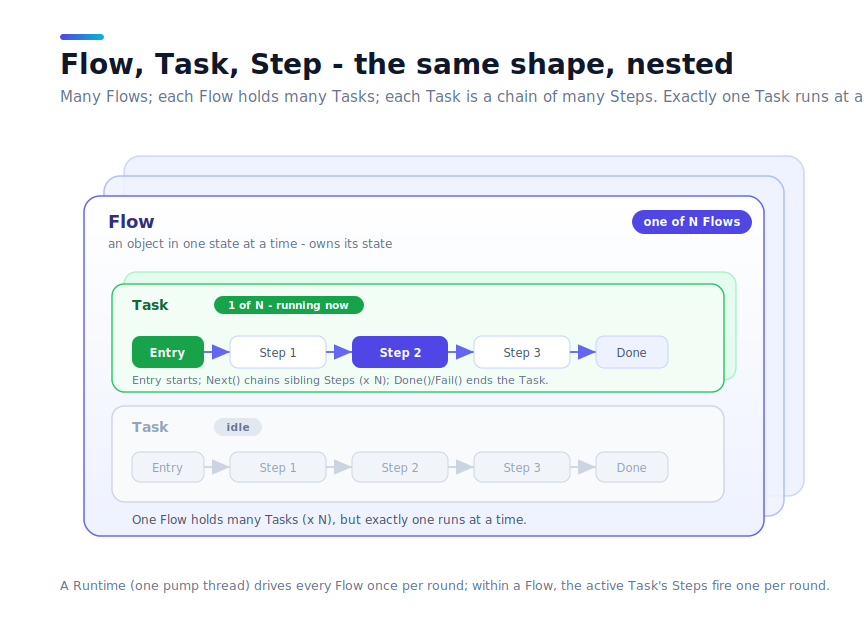
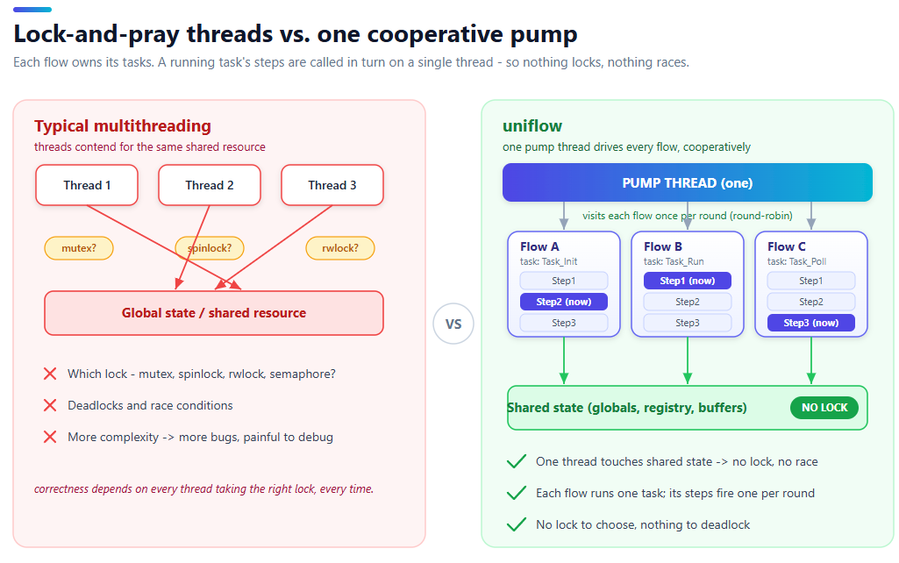

# uniflow

> 언어: **한국어** | [English](README.md)

[](https://github.com/splendidz/uniflow/actions/workflows/ci.yml)


```
헤더 1개  |  외부 의존성 0  |  C++17  |  빌드 시스템 불필요
```

<p align="center">
  
  
</p>

<p align="center">
  <sub>왼쪽: 수십 대의 차량이 신호를 보며 주행하는 <a href="cpp/examples/city_traffic/">city_traffic</a> &nbsp;|&nbsp; 오른쪽: 존 충돌 없이 라인을 도는 두 피커 <a href="cpp/examples/pick_and_place/">pick_and_place</a></sub><br>
  <sub>두 데모 모두 애플리케이션 스레드 0개. 모든 flow가 단일 펌프 스레드 위에서 협동 실행됩니다.</sub>
</p>

---

## What uniflow is.

uniflow는 **tick-based FSM(finite state machine) 기반의 비동기 실행 프레임워크**다. 단, `switch`와 `sleep`으로 loop을 수행하던 전통적인 방식이 아니라 **이벤트엔 즉시 반응하고 idle엔 CPU를 놓는 smart-polling** 방식으로, 그 레거시 tick-based FSM의 고질적인 단점을 걷어낸다.

pump가 매 tick마다 모듈의 현재 step을 한 번 호출하면, step은 blocking 없이 끝까지 실행하고 다음에 뭘 할지 스텝 진행 결과만 돌려준다. Step이 중간에 멈추지 않고 매 호출마다 통째로 돌고 빠지는 이 방식을 엄밀히는 run-to-completion이라 한다.

장비 제어나 임베디드를 해봤다면 익숙할, single thread에서 순서 있는 로직을 loop으로 수행하는 전통적인 tick-based FSM은 대개 이렇게 생겼다.

```cpp
// 전통적인 tick-based FSM 방식
int step_no = 0;
while (running_)
{
    switch (step_no)
    {
    case 0: Init();   step_no++; break;   // 단계가 정수 하나에만 의존한다
    case 1: if (Ready()) step_no++; break;
    case 2: Process(); step_no++; break;
    }
    sleep(10);   // 항상 10ms 대기 - 일 중에도, idle에도 구분 없이
}
```

uniflow는 이 모델을 그대로 따르되 두 가지를 프레임워크가 대신 책임진다. 첫째, 거대한 `switch`와 정수 `step_no` 대신 **이름 붙은 step 함수의 chain**으로 흐름을 표현한다. 둘째, 고정된 `sleep(10)` 대신 **상황에 맞는 대기**를 pump가 고른다. transition이 이어지면 쉬지 않고, 다들 조건을 기다리는 polling 중이면 CPU를 거의 놓고, 외부 이벤트가 오면 `Wake()`로 즉시 깨어난다. 즉 **순진한 busy-loop가 아니다.**

비동기 처리라는 목적은 Boost.Asio나 C++20 코루틴과 겹친다. 다만 접근이 다르다.

- **Boost.Asio와 비교:** Asio는 강력하지만, 이를 도입하려면 `io_context` / `awaitable` / executor 같은 Asio 계열 타입 한 벌을 받아들이고 그 위에서 코드를 재구성해야 한다. 통신 / 소켓 영역에 특화되어 있다. uniflow는 **헤더 하나(header only), 의존성 0**이고 기존 객체(소켓, 파일 IO, 디바이스 핸들 등)를 바꾸지 않는다. 그 객체들은 그대로 둔 채, 그것들을 다루는 **로직**만 단계 체인으로 정형화한다. 새 클래스 방법론을 학습할 필요가 없어 도입 비용이 낮다.

- **C++20 코루틴과 비교:** 코루틴은 언어 기본 지원이라 강력하지만, 그만큼 **스타일을 강제하지 못한다**. 코루틴을 어떤 단위로 분할하는지가 개발자마다 달라 시간이 지나면 다시 파편화된다. 그리고 C++20이 필요하다. uniflow는 **C++17**에서 동작해 기존 프로젝트의 버전 호환을 지키며, `task` 단위로 상태를 강제한다. 개발자의 실수로 어떤 단계에서 잘못된 상태 혹은 단계로 점프하는 일을 **프레임워크 수준에서 예방할 수 있다**.

| | Boost.Asio | C++20 코루틴 | uniflow |
|---|---|---|---|
| 도입 비용 | Asio 타입 한 벌 학습 | C++20 필요 | 헤더 1개, C++17, 의존성 0 |
| 기존 객체 | Asio 계열로 흡수 | 자유롭지만 정형 없음 | 변경 없이 그대로 사용 |
| 개발 스타일 | 통신 특화 | 개발자 역량 의존 | flow / task로 강제 |
| 실행 흐름 관측 | 직접 구현 | 직접 구현 | 옵저버 내장 |

### 핵심 가치: 비동기보다 "정형화"

uniflow의 핵심 가치는 비동기 그 자체가 아니라 **개발 방식을 정형화한다**는 데 있다.

- **flow / task라는 강제된 골격.** 기능 하나를 추가할 때마다 "이건 어떤 배타 단위(flow)에 속하나", "어떤 작업(task)이고 어떤 단계로 나뉘나"를 먼저 정하지 않으면 코드가 성립하지 않는다. 즉 프레임워크가 개발자에게 OOP 관점의 설계를 한 번 더 강제한다. 언어 수준에서 자유롭게 짤 때는, 여유가 있을 땐 OOP적으로 고민하다가도 일정에 쫓기면 "일단 돌아가는 가장 빠른 방법"으로 플래그 하나 추가하고 조건문 하나 끼워넣기 십상이다. 그렇게 급하게 낸 코드가 쌓이면서 구조가 무너진다. uniflow에서는 그 지름길 자체가 막혀 있어, AI에게 시키든 직접 짜든 결과물이 동일하게 flow / task 골격으로 정형화된다. 기능과 코드가 늘어도 전부 같은 형태라 리뷰가 일관되고, 개발자의 역량이나 취향, 그날의 마감 압박과 무관하게 같은 구조로 짜이므로 프로젝트가 시간이 지나며 스파게티가 되는 것을 구조적으로 예방한다.
- **내장 옵저버.** 내 코드가 지금 어떤 단계를 지나는지, 무슨 작업을 진행 중인지, 어디서 느려지는지를 프레임워크가 트레이스로 노출한다. 별도 계측 없이 실행 흐름이 보인다. 디버깅과 운영 관측에 바로 쓰는, application-oriented한 설계다.
- **다른 도구와 함께.** uniflow는 결국 평범한 C++ 코드이므로 Asio든 코루틴이든 함께 사용할 수 있다. **개발 방법론**은 uniflow로 정하고, 통신 / IO 같은 영역은 적합한 도구를 이 틀 안에서 가져다 쓰면 된다.

한 줄로: **기존 객체를 건드리지 않고, 현재 로직을 정형화된 방법으로 비동기화한다.**

---

## 세 가지 개념: Flow / Task / Step

<p align="center">
  
</p>

uniflow의 개념은 일부러 세 개뿐이다. 나머지는 전부 이 셋을 돌리는 장치일 뿐이고, 이 셋만 손에 들어오면 모델 전체가 잡힌다.

**1) Flow는 한 번에 하나의 Task만 수행할 수 있는 객체(대상)다.** 엘리베이터 한 대(올라가는 중이면 동시에 내려갈 수 없다), 신호등 하나, 통신 연결 하나, 모터 축 하나, 주문 처리기 하나. 여러 Task를 맡을 수 있지만 한 순간엔 그중 하나만 그 위에서 돈다 - 그렇게 "한 번에 하나의 상태"인 객체가 Flow다. 판단 기준은 단순하다: *두 작업이 그 위에서 겹칠 수 있는가?* 자동차 '전체'는 좋은 반례인데, 구동과 조향이 동시에 제어되기 때문이다. 그럴 땐 자동차가 하나의 Flow가 아니라 구동 축과 조향 축이 각각 하나의 Flow가 되고, 여러 Flow가 함께 돈다. (여러 Flow를 한 스레드 위에서 굴리는 것이 uniflow의 핵심이다. 아래 "한 스레드, 락 없음" 부분에서 다시 다룬다.)

**2) Task는 그 Flow가 수행하는 하나의 작업 단위다.** 구동 축이라면 "전진", "후진"이 Task고, 이벤트 프로세서라면 "이벤트 타입 A 처리"가 Task다. 하나의 Flow는 여러 Task를 가질 수 있지만 한 번에 하나만 실행하며, 어떤 Task가 실행 중인지가 그 Flow의 현재 역할을 결정한다 - 이것이 Flow 배타성의 핵심이다. Task는 "시작과 끝이 있는, 이름 붙은 Step들의 유한한 사슬"이다. `Entry`에서 시작해 형제 Step들로 이어지다가 끝난다.

**3) Step은 Task를 이루는 원자 단위이고, 함수 하나다.** Step은 처음부터 끝까지 실행되고, 중간에 절대 멈춰서 기다리지 않으며, 마지막에 다음에 뭘 할지 딱 네 가지 결과 중 하나로 답한다.

- `Next(...)` - 다음 Step으로 간다
- `Stay()` - 이 Step에 머문다. 다음 차례에 다시 불러줘 (멈추지 않고 기다리는 방법 - `while`도 `sleep`도 없다)
- `Done()` - 이 Task 정상 종료
- `Fail()` - 이 Task 실패

이게 어휘의 전부다. 그리고 Step은 선언(목록에 적힌 이름)과 본문이 분리돼 있어서, 함수 이름만 위에서 아래로 읽으면 전체 흐름이 한눈에 들어온다.

---

## Quick Start

위의 세 개념을 염두에 두고, 가장 작은 완전한 flow를 보자. 선언부와 본문을 분리해서 보면 구조가 한눈에 들어온다 - 선언(`struct`)은 흐름의 골격이고, 본문은 그 아래에 둔다(실제 프로젝트에선 `.cpp`).

<details open>
<summary><b>C++</b></summary>

```cpp
#include "uniflow.hpp"

// 하나의 flow = 하나의 모듈. Uniflow 베이스가 자신을 펌프에 등록한다.
class Flow_Example : public uniflow::Uniflow<Flow_Example>
{
public:
    explicit Flow_Example(uniflow::Runtime& rt)
        : uniflow::Uniflow<Flow_Example>(rt, "Example")
    {
        AddTask(task_);                 // task를 flow에 연결 (한 줄, task당 한 번)
    }

    // task = 단위 작업. 자신의 스텝 멤버 함수를 소유한다. public이라 외부에서 진입 가능.
    struct MyTask : uniflow::Task<Flow_Example>
    {
        StepResult Entry() override { return Step1_Begin(); }   // 진입 스텝 지정

    private:                           // 나머지 스텝은 private - Entry/Next로만 도달
        StepResult Step1_Begin();
        StepResult Step2_Work();
        StepResult Step3_Done();
    } task_;

private:
    bool ready_ = true;                // 상태는 flow가 들고, 스텝은 flow()로 읽는다
};

uniflow::StepResult Flow_Example::MyTask::Step1_Begin()
{
    Describe("초기화 완료");            // 트레이스/로그에 남는 한 줄 설명
    return Next(UF_FN(Step2_Work));    // 같은 task의 다음 스텝으로 전진
}

uniflow::StepResult Flow_Example::MyTask::Step2_Work()
{
    if (!flow().ready_) return Stay();  // 조건 충족까지 이 스텝을 재폴링 (블로킹 없음)
    return Next(UF_FN(Step3_Done));
}

uniflow::StepResult Flow_Example::MyTask::Step3_Done()
{
    return Done();                     // flow 정상 종료 -> 모듈 idle
}

int main()
{
    uniflow::Runtime rt;               // 펌프 스레드 1개를 띄운다
    Flow_Example     flow{rt};

    flow.task_.StartFlow();             // 어느 스레드에서도 호출 가능
    flow.WaitUntilIdle();
}
```

</details>

<details>
<summary><b>Python</b></summary>

```python
import uniflow


# 하나의 flow = 하나의 모듈. Uniflow 베이스가 자신을 펌프에 등록한다.
class Flow_Example(uniflow.Uniflow):
    def __init__(self, rt):
        super().__init__(rt, name="Example")
        self.ready = True              # 상태는 flow가 들고, 스텝은 flow()로 읽는다
        self.task = self.MyTask()
        self.AddTask(self.task)         # task를 flow에 연결 (한 줄, task당 한 번)

    # task = 단위 작업. 자신의 스텝 메서드를 소유한다.
    class MyTask(uniflow.Task):
        def Entry(self):
            return self.Step1_Begin()  # 진입 스텝 지정

        def Step1_Begin(self):
            self.Describe("초기화 완료")              # 트레이스/로그에 남는 한 줄 설명
            return self.Next(self.Step2_Work)         # 같은 task의 다음 스텝으로 전진

        def Step2_Work(self):
            if not self.flow().ready:
                return self.Stay()     # 조건 충족까지 이 스텝을 재폴링 (블로킹 없음)
            return self.Next(self.Step3_Done)

        def Step3_Done(self):
            return self.Done()         # flow 정상 종료 -> 모듈 idle


def main():
    rt = uniflow.Runtime()             # 펌프 스레드 1개를 띄운다
    flow = Flow_Example(rt)

    flow.task.StartFlow()               # 어느 스레드에서도 호출 가능
    flow.WaitUntilIdle()
    rt.stop()


if __name__ == "__main__":
    main()
```

</details>

<details>
<summary><b>C#</b></summary>

```csharp
using Uniflow;

// 하나의 flow = 하나의 모듈. Module 베이스가 자신을 펌프에 등록한다.
sealed class Flow_Example : Module
{
    public bool Ready = true;          // 상태는 flow가 들고, 스텝은 Flow로 읽는다
    public readonly MyTask TaskT;

    public Flow_Example(Runtime rt) : base(rt, "Example")
    {
        TaskT = new MyTask();
        AddTask(TaskT);                  // task를 flow에 연결 (한 줄, task당 한 번)
    }

    // task = 단위 작업. 자신의 스텝 메서드를 소유한다.
    public sealed class MyTask : Task<Flow_Example>
    {
        protected override StepResult Entry() => Step1_Begin();   // 진입 스텝 지정

        StepResult Step1_Begin()
        {
            Describe("초기화 완료");               // 트레이스/로그에 남는 한 줄 설명
            return Next(Step2_Work);              // 같은 task의 다음 스텝으로 전진
        }

        StepResult Step2_Work()
        {
            if (!Flow.Ready) return Stay();        // 조건 충족까지 재폴링 (블로킹 없음)
            return Next(Step3_Done);
        }

        StepResult Step3_Done()
        {
            return Done();                         // flow 정상 종료 -> 모듈 idle
        }
    }
}

static class Program
{
    public static void Main()
    {
        using var rt = new Runtime();              // 펌프 스레드 1개를 띄운다
        var flow = new Flow_Example(rt);

        flow.TaskT.StartFlow();                      // 어느 스레드에서도 호출 가능
        flow.WaitUntilIdle();
    }
}
```

</details>

---

## 메시지 펌프 (The Message Pump)

uniflow의 실행 단위는 **펌프 스레드**다. 핵심 발상은 **동시에 진행할 작업마다 스레드를 만들지 않는다**는 것이다. `Runtime` 하나가 펌프 스레드 하나를 소유하고, 거기에 엮인 여러 flow 모듈을 **매 라운드마다 한 번씩** 순회하며 그 한 스레드 위에서 협동 실행한다(Round-Robin 방식). 수십 개의 flow가 하나의 스레드를 공유한다. 그렇기 때문에 공유자원에 대한 락을 설정할 필요가 없다(Lock-Free). 그렇다고 단일 스레드에 종속되지도 않는다 - 병렬이 필요하면 `Runtime`을 여러 개 만들어 펌프 스레드를 늘리면 된다. 한 라운드는 세 단계로 진행된다.

<!-- 다이어그램: 펌프 라운드 - Post 드레인 -> 모듈 1회씩 실행 -> sleep 레벨 선택 -> 반복 -->

1. **Post 드레인** - 다른 스레드가 `Post()`로 넣어둔 콜백을 먼저 비운다. 이 콜백은 펌프 스레드에서 실행되므로 모듈 상태를 락 설정 없이 만질 수 있다.
2. **모듈 1회 실행** - 활성 모듈마다 현재 스텝 본문을 정확히 한 번 호출한다. 스텝은 `Stay`/`Next`/`Done`/`Fail` 중 하나의 의도만 돌려준다 (절대 블로킹하지 않는 Round-Robin).
3. **sleep 레벨 선택** - 이번 라운드에서 가장 바빴던 모듈을 기준으로 다음 라운드까지의 대기를 고른다.

| 이번 라운드 결과 | 다음 대기 | 의미 |
|---|---|---|
| 한 모듈이라도 `Next`/`Done`/`Fail`로 **전진** | `step_interval_sleep_ms` (기본 0) | 연속 전이는 쉬지 않고 바로 다음 라운드 |
| 전부 `Stay` **폴링 중** | `stay_sleep_ms` (기본 20ms) | 정상 폴링 주기. CPU 거의 0 |
| 모든 모듈 **idle** | `idle_sleep_ms` (기본 1ms) | 새 작업을 빠르게 픽업 |

핵심은 두 가지다. 첫째, **모든 모듈이 같은 한 스레드 위에서 한 번에 하나씩** 실행되므로 모듈 간 공유 상태에 락이 필요 없다(Lock-Free) - 이것이 뒤따르는 거의 모든 장점의 근간이다. 둘째, 대기는 고정된 sleep이 아니라 **상황에 따라 결정**되므로, 작업이 몰릴 때는 대기 없이 진행하고 idle 상태에서는 CPU를 양보한다.

외부 이벤트(네트워크 수신, 센서 인터럽트)가 들어오면 어느 스레드에서든 `rt.Wake()`를 호출해 대기 중인 펌프를 즉시 깨운다. 펌프가 잠든 시간을 기다리지 않는다.

스레드 경계는 **작업 단위가 아니라 설계자가** 정한다. 여러 `Runtime`을 두면 펌프 스레드도 그만큼 늘어나 진짜 병렬이 되고, 반대로 두 `Runtime`을 `Runtime::Link()`로 한 펌프 스레드에 합치면 양쪽 flow가 다시 락 없는 한-스레드 불변식을 공유한다.

---

## 핵심 장점 (Why uniflow)

### 1. Smart Polling - switch/sleep 구조의 근본적 개선

순서 있는 로직을 단일 스레드로 구현할 때 과거에 흔히 쓰인 방식이 있다.

```cpp
// 전통적인 tick-based FSM 방식
int step_no = 0;
while (running_)
{
    switch (step_no)
    {
    case 0: Init();   step_no++; break;   // 단계가 정수 하나에만 의존한다
    case 1: if (Ready()) step_no++; break;
    case 2: Process(); step_no++; break;
    }
    sleep(10);   // 항상 10ms 대기 - 일 중에도, idle에도 구분 없이
}
```

이 구조에는 다섯 가지 문제가 있다.

첫째, 폴링 주기가 고정이다. 단계 전환이 연속으로 일어날 때도 sleep이 개입하므로 응답성이 떨어진다.

둘째, 외부 이벤트(네트워크 수신, 센서 인터럽트)가 들어와도 최대 sleep 시간만큼 반응이 늦는다.

셋째, 모든 로직이 하나의 switch 블록 안에 쌓이므로 단계가 늘수록 함수가 비대해진다.

넷째, **구조를 강제하는 것이 없다.** 단계를 정수로 굴리든 bool 플래그 더미로 굴리든 자유이므로, 같은 로직도 개발자마다 전혀 다른 모양이 된다. 리뷰에서 흐름을 매번 새로 읽어내야 한다.

다섯째, **명시적인 흐름이 보장되지 않는다.** 어디서든 `step_no = 1`을 대입해 단계 한가운데로 끼어들 수 있다. 어느 코드가 어디로 점프시키는지 추적이 어렵고 진입점이 흐려진다.

uniflow는 [메시지 펌프](#메시지-펌프-the-message-pump)가 대기 주기를 상황에 맞게 고르고(전이 중엔 쉬지 않고, idle엔 CPU를 놓는다), 각 단계를 이름 있는 함수로 못박아 위 다섯 문제를 구조적으로 없앤다.

<!-- 다이어그램: 스마트 폴링 타임라인 - 전이=0 sleep, 폴링=20ms, idle=1ms, 이벤트 도착 시 즉시 wake -->

외부 이벤트가 들어오면 어느 스레드에서든 `rt.Wake()`로 잠든 펌프를 즉시 깨운다.

```cpp
// 예시. 이벤트 수신 스레드 (별도 스레드) 이벤트 수신했을 때
// 바로 uniflow task가 작업 할 수 있도록 runtime(메시지 펌프)를 즉시 깨운다.
void OnNetworkReceived(Packet pkt)
{
    module_.SetPendingPacket(pkt);
    runtime_.Wake();         // 펌프를 즉시 깨운다 - sleep 대기 없음
}
```

---

### 2. Single Thread, Many Modules - 단일 스레드 협동 실행

<p align="center">
  
</p>
<p align="center">
  <sub>왼쪽: 여러 스레드가 락 뒤에서 공유 상태를 두고 경합한다. 오른쪽: 펌프 스레드 하나가 각 flow의 task step을 번갈아 호출하므로 공유 상태에 락이 필요 없다.</sub>
</p>

하나의 `Runtime`은 하나의 펌프 스레드를 소유한다. 이 스레드 위에 원하는 만큼의 모듈을 붙일 수 있으며, 펌프는 매 라운드마다 모든 모듈을 순서대로 한 번씩 실행한다.

```cpp
uniflow::Runtime rt;            // 펌프 스레드 하나

Flow_XAxis    x_axis{rt};       // X축 관련 Task 집합
Flow_YAxis    y_axis{rt};       // Y축 관련 Task 집합
Flow_Conveyor conveyor{rt};     // Conveyor 관련 Task 집합
Flow_Gripper  gripper{rt};      // Gripper 관련 Task 집합

// 네 모듈이 한 스레드 위에서 동시에 진행 - 뮤텍스 없음
x_axis.task_home_.StartFlow();
conveyor.task_run_.StartFlow();
```

같은 `Runtime` 위의 모듈들은 단일 스레드 불변식을 공유하므로, 모듈 간 상태 접근에 뮤텍스가 필요 없다. X축이 `Stay()` 폴링 중인 라운드에도 컨베이어의 단계가 진행된다.

아래는 두 축이 실제로 동시에 움직이는 동작을 보여주는 구체적인 예다. 스레드는 하나지만, 두 모듈이 각자의 스텝에서 `Stay()`로 대기하는 동안 상대방의 스텝이 실행된다.

<details open>
<summary><b>C++</b></summary>

```cpp
// X축과 Y축을 동시에 홈 복귀시키는 예
//
// 전통 방식 (스레드 두 개 필요):
//   std::thread t1([]{ x_axis.GoHome(); });   // 블로킹 함수
//   std::thread t2([]{ y_axis.GoHome(); });
//   t1.join(); t2.join();
//
// uniflow 방식 (스레드 하나):
//   x_axis.task_home_.StartFlow();
//   y_axis.task_home_.StartFlow();
//   rt.WaitAll();

// -- Flow_XAxis ---------------------------------
class Flow_XAxis : public uniflow::Uniflow<Flow_XAxis>
{
public:
    Flow_XAxis(uniflow::Runtime& rt) : uniflow::Uniflow<Flow_XAxis>(rt, "XAxis")
    {
        AddTask(task_home_);
    }

    struct Task_Home : uniflow::Task<Flow_XAxis>
    {
        StepResult Entry() override { return Step1_CmdMove(); }
    private:
        StepResult Step1_CmdMove()
        {
            flow().motor_.MoveTo(0);            // 이동 명령만 내리고 즉시 반환
            return Next(UF_FN(Step2_Wait));
        }
        StepResult Step2_Wait()
        {
            if (!flow().motor_.InPosition())
                return Stay();                  // 아직 이동 중 - 이 라운드는 여기서 끝
            return Done();                      // 완료
        }
    } task_home_;

private:
    Motor motor_;
};

// Flow_YAxis도 동일한 구조 (생략)

// -- 실행 --
uniflow::Runtime rt;
Flow_XAxis x_axis{rt};
Flow_YAxis y_axis{rt};

x_axis.task_home_.StartFlow();   // X 홈 복귀 시작
y_axis.task_home_.StartFlow();   // Y 홈 복귀 시작 (동시에)

// 펌프 라운드마다:
//   Round 1: X.Step1(이동 명령) -> Next  |  Y.Step1(이동 명령) -> Next
//   Round 2: X.Step2(이동 중)   -> Stay  |  Y.Step2(이동 중)   -> Stay
//   Round N: X.Step2(완료)      -> Done  |  Y.Step2(이동 중)   -> Stay
//   Round M: (X idle)           |  Y.Step2(완료) -> Done
//
// X가 Stay()에서 기다리는 동안 Y가 실행되고, 반대도 마찬가지.
// 두 축이 동시에 움직이되 뮤텍스 없이.

x_axis.WaitUntilIdle();
y_axis.WaitUntilIdle();
```

</details>

<details>
<summary><b>Python</b></summary>

```python
# X축과 Y축을 동시에 홈 복귀시키는 예
#
# 전통 방식 (스레드 두 개 필요):
#   t1 = threading.Thread(target=x_axis.go_home)   # 블로킹 함수
#   t2 = threading.Thread(target=y_axis.go_home)
#   t1.start(); t2.start(); t1.join(); t2.join()
#
# uniflow 방식 (스레드 하나):
#   x_axis.task_home.StartFlow()
#   y_axis.task_home.StartFlow()
#   rt.WaitUntilIdle()

# -- Flow_XAxis ---------------------------------
class Flow_XAxis(uniflow.Uniflow):
    def __init__(self, rt):
        super().__init__(rt, name="XAxis")
        self.motor = Motor()
        self.task_home = self.Task_Home()
        self.AddTask(self.task_home)

    class Task_Home(uniflow.Task):
        def Entry(self):
            return self.Step1_CmdMove()

        def Step1_CmdMove(self):
            self.flow().motor.MoveTo(0)          # 이동 명령만 내리고 즉시 반환
            return self.Next(self.Step2_Wait)

        def Step2_Wait(self):
            if not self.flow().motor.InPosition():
                return self.Stay()               # 아직 이동 중 - 이 라운드는 여기서 끝
            return self.Done()                   # 완료


# Flow_YAxis도 동일한 구조 (생략)

# -- 실행 --
rt = uniflow.Runtime()
x_axis = Flow_XAxis(rt)
y_axis = Flow_YAxis(rt)

x_axis.task_home.StartFlow()   # X 홈 복귀 시작
y_axis.task_home.StartFlow()   # Y 홈 복귀 시작 (동시에)

# 펌프 라운드마다:
#   Round 1: X.Step1(이동 명령) -> Next  |  Y.Step1(이동 명령) -> Next
#   Round 2: X.Step2(이동 중)   -> Stay  |  Y.Step2(이동 중)   -> Stay
#   Round N: X.Step2(완료)      -> Done  |  Y.Step2(이동 중)   -> Stay
#
# X가 Stay()에서 기다리는 동안 Y가 실행되고, 반대도 마찬가지.
# 두 축이 동시에 움직이되 락 없이.

x_axis.WaitUntilIdle()
y_axis.WaitUntilIdle()
```

</details>

<details>
<summary><b>C#</b></summary>

```csharp
// X축과 Y축을 동시에 홈 복귀시키는 예
//
// 전통 방식 (스레드 두 개 필요):
//   var t1 = new Thread(() => xAxis.GoHome());   // 블로킹 함수
//   var t2 = new Thread(() => yAxis.GoHome());
//   t1.Start(); t2.Start(); t1.Join(); t2.Join();
//
// uniflow 방식 (스레드 하나):
//   xAxis.TaskHome.StartFlow();
//   yAxis.TaskHome.StartFlow();
//   rt.WaitUntilIdle();

// -- Flow_XAxis ---------------------------------
sealed class Flow_XAxis : Module
{
    public readonly Motor Motor = new Motor();
    public readonly Task_Home TaskHome;

    public Flow_XAxis(Runtime rt) : base(rt, "XAxis")
    {
        TaskHome = new Task_Home();
        AddTask(TaskHome);
    }

    public sealed class Task_Home : Task<Flow_XAxis>
    {
        protected override StepResult Entry() => Step1_CmdMove();

        StepResult Step1_CmdMove()
        {
            Flow.Motor.MoveTo(0);            // 이동 명령만 내리고 즉시 반환
            return Next(Step2_Wait);
        }

        StepResult Step2_Wait()
        {
            if (!Flow.Motor.InPosition())
                return Stay();               // 아직 이동 중 - 이 라운드는 여기서 끝
            return Done();                   // 완료
        }
    }
}

// Flow_YAxis도 동일한 구조 (생략)

// -- 실행 --
using var rt = new Runtime();
var xAxis = new Flow_XAxis(rt);
var yAxis = new Flow_YAxis(rt);

xAxis.TaskHome.StartFlow();   // X 홈 복귀 시작
yAxis.TaskHome.StartFlow();   // Y 홈 복귀 시작 (동시에)

// 펌프 라운드마다:
//   Round 1: X.Step1(이동 명령) -> Next  |  Y.Step1(이동 명령) -> Next
//   Round 2: X.Step2(이동 중)   -> Stay  |  Y.Step2(이동 중)   -> Stay
//   Round N: X.Step2(완료)      -> Done  |  Y.Step2(이동 중)   -> Stay
//
// X가 Stay()에서 기다리는 동안 Y가 실행되고, 반대도 마찬가지.
// 두 축이 동시에 움직이되 락 없이.

xAxis.WaitUntilIdle();
yAxis.WaitUntilIdle();
```

</details>

실제 블로킹 작업(I/O, 무거운 연산)은 `SubmitAsync`를 통해 내장 스레드 풀로 위임하며, 완료 시 펌프를 깨운다. 펌프 스레드 자체는 절대 블로킹되지 않는다.

복수의 `Runtime`을 생성하면 펌프 스레드도 복수가 된다. `Runtime::Link()`로 두 런타임을 하나의 펌프 스레드 위에 합칠 수도 있다.

---

### 3. Flat Structure - 플랫한 코드 구조와 팀 일관성

순서 있는 로직을 직접 구현하면 플래그와 조건문이 중첩되면서 코드 depth가 깊어지는 것이 일반적이다. 숙련된 개발자도 시간이 지나고 요구사항이 추가되면 이 문제를 피하기 어렵다.

```cpp
// 전형적인 플래그 기반 구조 - 단계와 예외 경로가 늘수록 중첩과 플래그가 폭발한다
void Update()
{
    if (estop_)
    {
        // e-stop 은 어느 단계에서도 들어올 수 있다 - 모든 진행 플래그를 여기서 되돌려야 한다
        connecting_ = false;
        cmd_sent_   = false;
        waiting_ack_ = false;
        // draining_ 을 빠뜨렸다 - 다음 사이클에 유령 ack 를 기다리는 버그
        if (!device_.IsSafe())
        {
            return;
        }
        estop_ = false;
    }

    if (!connected_)
    {
        if (!connecting_)
        {
            device_.BeginConnect();
            connecting_   = true;
            connect_timer_.Restart();
        }
        else if (device_.IsConnected())
        {
            connected_  = true;
            connecting_ = false;
        }
        else if (connect_timer_.Passed(5000ms))
        {
            if (++reconnect_count_ > 3)
            {
                fault_ = true;       // 단, fault_ 를 보는 곳은 함수 맨 위가 아니라 저 아래
            }
            connecting_ = false;     // 재시도 위해 리셋 - reconnect_count_ 리셋은 어디서?
        }
    }
    else if (!cmd_sent_)
    {
        if (input_.HasRequest() && !draining_)
        {
            device_.Send(input_.Take());
            cmd_sent_    = true;
            waiting_ack_ = true;     // 두 플래그가 항상 짝으로 움직여야 한다는 암묵 규칙
            cmd_timer_.Restart();
        }
    }
    else if (waiting_ack_)
    {
        if (device_.HasAck())
        {
            // 성공 - 이 5줄 중 하나라도 빠지면 다음 명령이 영원히 막힌다
            cmd_sent_     = false;
            waiting_ack_  = false;
            retry_count_  = 0;
            reconnect_count_ = 0;
            draining_     = input_.HasRequest();
        }
        else if (cmd_timer_.Passed(3000ms))
        {
            if (++retry_count_ < 3)
            {
                cmd_sent_    = false;   // Step3 로 되돌리는 것을 플래그 조합으로 흉내낸다
                waiting_ack_ = false;
            }
            else if (!fault_)
            {
                fault_ = true;
                connected_ = false;    // 연결까지 되돌린다 - 그럼 reconnect_count_ 는...?
            }
        }
    }
    // fault_ 처리는? estop_ 와 fault_ 가 동시면? 분기 어디에도 명시되지 않는다
}
```

uniflow에서 같은 로직은 각 단계가 이름 있는 함수 하나가 된다.

```cpp
StepResult Step1_Connect()
{
    flow().device_.BeginConnect();
    return Next(UF_FN(Step2_WaitConnected));
}

StepResult Step2_WaitConnected()
{
    if (!flow().device_.IsConnected()) return Stay();   // 연결될 때까지 이 스텝 재폴링
    return Next(UF_FN(Step3_WaitRequest));
}

StepResult Step3_WaitRequest()
{
    if (!flow().input_.HasRequest()) return Stay();
    flow().device_.Send(flow().input_.Take());
    return Next(UF_FN(Step4_WaitAck));
}

StepResult Step4_WaitAck()
{
    if (flow().device_.HasAck()) { flow().OnSuccess(); return Done(); }
    return StayTimeout(3000ms, UF_FN(Step5_Timeout));     // 3초 안에 ack 없으면 타임아웃 스텝으로
}

StepResult Step5_Timeout()
{
    if (++retry_count < 3) return Next(UF_FN(Step3_WaitRequest));   // retry_count는 task 멤버
    flow().OnFail();
    return Fail();
}
```

위 플래그 버전에서 폭발하던 것 - `connected_`/`connecting_`/`cmd_sent_`/`waiting_ack_`/`draining_`/`fault_`/`estop_` 가 서로의 리셋을 암묵적으로 책임지고, e-stop 과 fault 가 어느 분기에서도 끼어들 수 있어 "리셋 목록을 빠뜨리면 버그"가 되던 구조 - 가 사라진다. 중괄호 depth가 고정되고, 각 상태는 이름 있는 스텝 하나가 된다. e-stop/fault 같은 횡단 경로조차 플래그가 아니라 명시적 전이(`StayTimeout`/`Next`/`Fail`)로 표현되므로, 단계를 추가할 때 함수 하나를 더하고 연결만 바꾸면 되며 나머지 단계는 손대지 않는다.

이 구조는 팀 작업에서도 이점이 있다. 모든 개발자가 동일한 패턴으로 로직을 표현하므로 코드 리뷰에서 단계 구조가 즉시 파악된다. 프레임워크가 패턴을 강제하므로, 경험 수준에 관계없이 일관된 코드가 만들어진다.

---

### 4. Built-in Tracing - 내장 트레이스와 관측성

모든 실행이 "단계 함수가 한 번 호출됐다"는 단일 형태로 환원되므로, 펌프 내부의 측정 지점 하나가 전체 flow를 관측한다. 기본 `ConsoleObserver`를 사용하면 별도의 로깅 코드 없이 다음 정보가 자동으로 기록된다.

```
[JobWorker    ] FLOW START  caller=main.cpp:42 main()
[JobWorker    ] Entry -> Step2_Validate                         #00 elapsed=0.01ms  tick x8 avg=0.01ms
[JobWorker    ]                 ASYNC SUBMIT  CallApi
[JobWorker    ]                 ASYNC DONE    CallApi  wait=124.38ms
[JobWorker    ] Step2_Validate -> Step3_WaitSave  inserted=3000  #01 elapsed=124.42ms tick x1 avg=0.03ms
[JobWorker    ] Step3_WaitSave -> Done                           #02 elapsed=18.71ms  tick x1
[JobWorker    ] FLOW END  DONE  steps=#02  wall=143.21ms  step=0.07ms  async=143.09ms  tick x10 avg=0.01ms
```

각 줄에는 이전 단계에서 다음 단계로의 전환, 해당 단계에 소요된 시간, 본문 실행 통계, 비동기 대기 시간, `Describe()`로 설정한 설명이 포함된다.

느린 단계 알람, 느린 비동기 작업 알람, 라운드 단위 프로파일링도 설정 가능하다.

```cpp
uniflow::Runtime::Opts opts;
opts.config.slow_step_threshold_ms  = std::chrono::milliseconds(10);   // 단계 본문이 10ms 초과 시 경고
opts.config.slow_async_threshold_ms = std::chrono::milliseconds(500);  // 비동기 작업이 500ms 초과 시 경고
uniflow::Runtime rt{std::move(opts)};
```

자체 메트릭 시스템이나 알림 채널에 연결하려면 `IUniflowObserver`를 상속해 필요한 훅만 재정의한다. 측정 지점이 로직 코드 곳곳이 아니라 한 곳에 있으므로 계측 코드와 비즈니스 로직이 분리된다.

---

### 5. Task - 단위 기반 타입 안전 + 명시적 전이 (Type-safe Units)

단계가 많아지면 어느 단계가 어느 논리적 작업에 속하는지 파악하기 어려워진다. uniflow는 관련된 단계들을 `uniflow::Task<Flow>`를 상속한 구조체로 묶는다. task는 자신의 스텝 멤버 함수를 직접 소유하므로, 각 스텝은 정의상 자신의 task에 속한다.

<details open>
<summary><b>C++</b></summary>

```cpp
class Flow_PickPlace : public uniflow::Uniflow<Flow_PickPlace>
{
public:
    explicit Flow_PickPlace(uniflow::Runtime& rt)
        : uniflow::Uniflow<Flow_PickPlace>(rt, "PickPlace")
    {
        AddTask(task_pick_);
        AddTask(task_place_);
    }

    // public - 오케스트레이터가 task.StartFlow()로 원하는 단위를 직접 진입
    struct Task_Pick : uniflow::Task<Flow_PickPlace>
    {
        int part_id = 0;                               // task 내 스텝들이 공유하는 상태
        StepResult Entry() override { return Step1_MoveToSource(); }

    private:
        StepResult Step1_MoveToSource()
        {
            part_id = flow().source_.NextPart();
            return Next(UF_FN(Step2_WaitAtSource));
        }

        StepResult Step2_WaitAtSource()
        {
            if (!flow().arm_.IsReady()) return Stay();
            flow().task_place_.slot = flow().dest_.FreeSlot();
            return StartTask(flow().task_place_);       // Task_Place로 전환
        }
    } task_pick_;

    struct Task_Place : uniflow::Task<Flow_PickPlace>
    {
        int slot = 0;
        StepResult Entry() override { return Step1_MoveToDest(); }

    private:
        StepResult Step1_MoveToDest()
        {
            flow().arm_.MoveTo(flow().dest_pos_[slot]);
            return Next(UF_FN(Step2_Release));
        }

        StepResult Step2_Release() { flow().arm_.Release(); return Done(); }
    } task_place_;
};
```

</details>

<details>
<summary><b>Python</b></summary>

```python
class Flow_PickPlace(uniflow.Uniflow):
    def __init__(self, rt):
        super().__init__(rt, name="PickPlace")
        self.task_pick = self.Task_Pick()
        self.AddTask(self.task_pick)
        self.task_place = self.Task_Place()
        self.AddTask(self.task_place)

    # public - 오케스트레이터가 task.StartFlow()로 원하는 단위를 직접 진입
    class Task_Pick(uniflow.Task):
        def __init__(self):
            super().__init__()
            self.part_id = 0                               # task 내 스텝들이 공유하는 상태

        def Entry(self):
            return self.Step1_MoveToSource()

        def Step1_MoveToSource(self):
            self.part_id = self.flow().source.NextPart()
            return self.Next(self.Step2_WaitAtSource)

        def Step2_WaitAtSource(self):
            if not self.flow().arm.IsReady():
                return self.Stay()
            self.flow().task_place.slot = self.flow().dest.FreeSlot()
            return self.StartTask(self.flow().task_place)   # Task_Place로 전환

    class Task_Place(uniflow.Task):
        def __init__(self):
            super().__init__()
            self.slot = 0

        def Entry(self):
            return self.Step1_MoveToDest()

        def Step1_MoveToDest(self):
            self.flow().arm.MoveTo(self.flow().dest_pos[self.slot])
            return self.Next(self.Step2_Release)

        def Step2_Release(self):
            self.flow().arm.Release()
            return self.Done()
```

</details>

<details>
<summary><b>C#</b></summary>

```csharp
sealed class Flow_PickPlace : Module
{
    public readonly Task_Pick TaskPick;
    public readonly Task_Place TaskPlace;

    public Flow_PickPlace(Runtime rt) : base(rt, "PickPlace")
    {
        TaskPick = new Task_Pick();
        AddTask(TaskPick);
        TaskPlace = new Task_Place();
        AddTask(TaskPlace);
    }

    // public - 오케스트레이터가 TaskT.StartFlow()로 원하는 단위를 직접 진입
    public sealed class Task_Pick : Task<Flow_PickPlace>
    {
        public int PartId;                                 // task 내 스텝들이 공유하는 상태
        protected override StepResult Entry() => Step1_MoveToSource();

        StepResult Step1_MoveToSource()
        {
            PartId = Flow.Source.NextPart();
            return Next(Step2_WaitAtSource);
        }

        StepResult Step2_WaitAtSource()
        {
            if (!Flow.Arm.IsReady()) return Stay();
            Flow.TaskPlace.Slot = Flow.Dest.FreeSlot();
            // C#에서 StartTask는 StepResult가 아니라 StartResult를 반환하므로 스텝이
            // "return StartTask(...)"를 할 수 없다. 이 task를 끝내고 pick_and_place
            // 예제처럼 오케스트레이터가 StartFlow()로 Task_Place를 띄운다.
            return Done();
        }
    }

    public sealed class Task_Place : Task<Flow_PickPlace>
    {
        public int Slot;
        protected override StepResult Entry() => Step1_MoveToDest();

        StepResult Step1_MoveToDest()
        {
            Flow.Arm.MoveTo(Flow.DestPos[Slot]);
            return Next(Step2_Release);
        }

        StepResult Step2_Release()
        {
            Flow.Arm.Release();
            return Done();
        }
    }
}

// Pick -> Place 오케스트레이션: Pick이 끝나면 오케스트레이터가 Place를 띄운다.
//   flow.TaskPick.StartFlow();  flow.WaitUntilIdle();
//   flow.TaskPlace.StartFlow(); flow.WaitUntilIdle();
```

</details>

스텝은 자기 task의 멤버라 그 task에 속하고, `Next`는 형제 스텝만 가리킨다. 다른 단위로 넘어가려면 `StartTask`로 task 경계를 명시적으로 건넌다. 단위 경계가 코드 구조에 그대로 드러나므로, 어느 스텝이 어느 단위인지 흐릿해지지 않는다.

**전이가 코드에 명시적으로 박힌다는 점이 핵심이다.** 각 스텝은 `Next(UF_FN(...))`로 다음 스텝을 직접 지목하고, 그 대상은 같은 task의 형제 스텝일 수밖에 없다. 그래서 함수 **선언 목록만 훑어도** 로직이 어떤 순서로 호출될 수밖에 없는지 - 어디서 시작해(`Entry`) 어디로 흘러가는지 - 가 드러난다. 외부에서 단계 한가운데로 끼어들 길이 없으니(스텝은 `private`, 진입은 `Entry`뿐), 숨은 진입점이나 추적 안 되는 점프가 없다. 흐름이 곧 타입과 선언으로 고정되어 가독성이 크게 올라간다.

각 task는 진입 시 `OnEnter()`가 호출되므로, 단위별 초기화(타이머 리셋, 카운터 초기화)를 여기서 처리할 수 있다. `Trajectory()`로 단위 내에서 방문한 단계와 각 단계 소요 시간의 이력도 조회할 수 있다.

---

### 6. Time Control - 시뮬레이터 가속/정지 (Scale & Freeze)

시뮬레이터를 uniflow로 구현하면 **전체 시뮬레이션의 배속과 정지를 별도 구현 없이 얻는다.** 모든 시간 기반 로직 - 스텝 타임아웃(`StayTimeout`), 경과/세틀 타이머(`UFTimer`, `HeldFor`) - 이 `Runtime`이 들고 있는 하나의 논리 시계를 따르기 때문이다. 그 시계 하나를 배속하거나 얼리면 위의 모든 flow가 함께 빨라지거나 멈춘다.

<!-- 다이어그램: 논리 시계 1개가 모든 flow의 StayTimeout/UFTimer를 구동 (SetScale/Freeze가 전체에 전파) -->

```cpp
uniflow::Runtime rt;

rt.clock().SetScale(10.0);   // 시뮬레이션 10배속 - 3초 타임아웃이 0.3초에 발화
rt.clock().Freeze();         // 전체 정지 (E-Stop/일시정지). 모든 타임아웃 카운트다운 멈춤
// ... 검사/복구 후
rt.clock().Resume();
```

타이머를 이 시계에 묶어 두면 배속/정지를 그대로 따라간다.

```cpp
uniflow::UFTimer settle{rt.clock()};   // runtime의 논리 시계에 바인딩
// ... 스텝 안에서
if (settle.HeldFor(sensor.IsReady(), 50ms)) return Next(UF_FN(Step2_Go));
```

논리 시계는 논리적 대기에만 적용된다. `SubmitAsync`의 실제 I/O 대기와 펌프 자체의 sleep은 실제 벽시계(wall clock)를 따르므로, 배속을 걸어도 네트워크 호출까지 빨라지지는 않는다 - 두 시계를 혼용해도 충돌이 없다.

---

## Async (SubmitAsync) - 비동기 작업 처리

단일 스레드 모델에서 가장 흔한 오해는 오래 걸리는 작업에서 펌프가 막힌다는 것이다. 실제로는 그렇지 않다. uniflow의 모델은 **libuv / Node.js의 이벤트 루프와 같은 발상**이다. 펌프 스레드는 절대 블로킹하지 않고, 무거운 작업(I/O, 연산)은 내장 스레드 풀로 던진 뒤 그 완료를 하나의 이벤트로 돌려받는다. 그동안 같은 `Runtime`의 다른 모든 모듈은 멈추지 않고 계속 돈다.

오히려 **오래 걸리는 작업일수록 관리가 더 쉬워진다.** 작업을 던지는 스텝과 결과를 받는 스텝이 분리되어 흐름이 명시적이고, 진행/타임아웃/실패가 트레이스에 그대로 남으며, 결과를 받는 연속 스텝도 펌프 스레드에서 실행되므로 공유 상태 경쟁이 없다.

단계 본문이 직접 블로킹되면 펌프 스레드 전체가 멈추므로, 블로킹 작업은 `SubmitAsync`로 스레드 풀에 위임한다. `SubmitAsync`는 그 작업을 식별하는 **`AsyncId`를 돌려준다**(거부되면 `0`). 이 id를 결과를 읽을 단계로 넘기고, 그 단계에서 `AsyncResult<T>(id)`로 받는다.

<details open>
<summary><b>C++</b></summary>

```cpp
StepResult Step1_FetchData()
{
    Describe("데이터 수신 중");
    // SubmitAsync는 AsyncId를 반환한다. id 0은 거부(in-flight 상한 초과 등).
    AsyncId job = SubmitAsync(UF_FN(DoFetch), std::chrono::milliseconds(5000), url);
    if (job == 0)
    {
        return Fail();
    }
    return Next(UF_FN(Step2_ProcessData), job);   // id를 다음 단계로 전달
}

StepResult Step2_ProcessData(AsyncId job)
{
    auto r = AsyncResult<std::string>(job);
    if (r.pending())                            // 아직 진행 중 -> 폴링
    {
        return StayTimeout(5000ms, UF_FN(Step_FetchGaveUp));
    }
    if (r.is_timeout() || r.failed() || !r.ok())
    {
        flow().log_.Error("fetch failed");
        return Fail();
    }
    data = *r.return_value;                     // state == Done 일 때만 채워짐
    return Next(UF_FN(Step3_Save));
}

StepResult Step_FetchGaveUp()
{
    ClearAsync();                               // 미완 워커 포기(observer 경고) 후 진행
    return Fail();
}

// 스레드 풀에서 실행되므로 반드시 static - 인스턴스 멤버 접근 불가
static std::string DoFetch(std::string url) { return http_.Get(url); }
```

</details>

<details>
<summary><b>Python</b></summary>

```python
def Step1_FetchData(self):
    self.Describe("데이터 수신 중")
    # SubmitAsync는 AsyncId를 반환한다. id 0은 거부(in-flight 상한 초과 등).
    job = self.SubmitAsync(self.DoFetch, "DoFetch", 5.0, self.url)
    if job == 0:
        return self.Fail()
    return self.Next(self.Step2_ProcessData, job)   # id를 다음 단계로 전달

def Step2_ProcessData(self, job):
    r = self.AsyncResult(job)
    if r.pending():                                 # 아직 진행 중 -> 폴링
        return self.StayTimeout(5.0, self.Step_FetchGaveUp)
    if r.is_timeout() or r.failed() or not r.ok():
        self.flow().log.Error("fetch failed")
        return self.Fail()
    self.data = r.return_value                       # state == Done 일 때만 채워짐
    return self.Next(self.Step3_Save)

def Step_FetchGaveUp(self):
    self.ClearAsync()                                # 미완 워커 포기 후 진행
    return self.Fail()

# 스레드 풀에서 실행되므로 static 워커 - 인스턴스 접근 불가
@staticmethod
def DoFetch(url):
    return Http.Get(url)
```

</details>

<details>
<summary><b>C#</b></summary>

```csharp
// _job은 AsyncId를 단계 간에 실어 나르는 task 필드 (Next는 인자를 받지 않는다).
int _job;

StepResult Step1_FetchData()
{
    Describe("데이터 수신 중");
    // SubmitAsync는 AsyncId를 반환한다. id 0은 거부(in-flight 상한 초과 등).
    _job = SubmitAsync(() => (object?)DoFetch(_url), "DoFetch", 5.0);
    if (_job == 0)
    {
        return Fail();
    }
    return Next(Step2_ProcessData);                 // 실어둔 id는 다음 단계에서 읽는다
}

StepResult Step2_ProcessData()
{
    var r = AsyncResult<string>(_job);
    if (r.Pending)                                  // 아직 진행 중 -> 폴링
    {
        return StayTimeout(5.0, Step_FetchGaveUp);
    }
    if (r.IsTimeout || r.Failed || !r.Ok)
    {
        Flow.Log.Error("fetch failed");
        return Fail();
    }
    _data = r.ReturnValue;                          // state == Done 일 때만 채워짐
    return Next(Step3_Save);
}

StepResult Step_FetchGaveUp()
{
    ClearAsync();                                   // 미완 워커 포기 후 진행
    return Fail();
}

// 스레드 풀에서 실행되므로 static 워커 - 인스턴스 접근 불가
static string DoFetch(string url) => Http.Get(url);
```

</details>

`SubmitAsync` 후에도 펌프는 그 모듈을 막지 않는다. 작업을 던진 단계는 곧장 다음 단계로 넘어가고, 결과를 기다리는 단계가 `AsyncResult<T>(id)`를 폴링해 `Pending`이면 스스로 `Stay`한다. 덕분에 **던진 직후 단계가 아니어도, 이후 어느 단계에서나** 결과를 받을 수 있다 - 중간에 다른 단계를 끼워 넣어도 문제없다. 작업이 끝나면 워커 스레드가 `rt.Wake()`를 호출해 펌프를 즉시 깨우므로, 폴링 주기를 기다리지 않고 완료 직후 잡힌다.

`AsyncResult<T>(id)`가 돌려주는 `AsyncOutcome<T>`는 다섯 상태를 갖는다: `NotFound`(잘못된/정리된/0 id), `Pending`, `Done`(`return_value`에 결과), `Failed`, `TimedOut`. 잘못된 id는 자연히 `NotFound`로 떨어져 null 역참조 없이 에러 분기로 흐른다.

**여러 작업을 동시에** 던지고 한 단계에서 모두 기다릴 수 있다. `AnyAsyncPending()`이 join-all 프리미티브다(데드라인은 `StayTimeout`로 직접).

```cpp
StepResult Step1_KickProbes()
{
    a_ = SubmitAsync(UF_FN(ReadSensorA));      // AsyncId 두 개 동시 진행
    b_ = SubmitAsync(UF_FN(ReadSensorB));
    if (a_ == 0 || b_ == 0)
    {
        return Fail();
    }
    return Next(UF_FN(Step2_Join), a_, b_);
}

StepResult Step2_Join(AsyncId a, AsyncId b)
{
    if (AnyAsyncPending())                      // 둘 다 끝날 때까지 폴링
    {
        return StayTimeout(2000ms, UF_FN(Step_ProbeTimeout));
    }
    use(*AsyncResult<int>(a).return_value, *AsyncResult<bool>(b).return_value);
    return Done();
}
```

타임아웃은 워커를 강제 종료하지 않는다(C++에는 스레드를 안전하게 죽일 방법이 없다). `TimedOut`은 "기다리기를 멈춘다"는 뜻이고, 워커는 백그라운드에서 자연 완료될 때까지 돈다. 정리가 필요하면 `ClearAsync()`로 슬롯을 버린다 - 미완 워커는 포기되고(결과 폐기) 워커마다 `OnAsyncAbandoned`가 발화해 누수가 로그에 보인다. 작업을 확인 없이 마구 던지는 것을 막기 위해, flow당 동시 in-flight 수가 `Config::max_inflight_async`를 넘으면 `SubmitAsync`는 `0`을 반환하고 `OnAsyncHighWater`로 경고한다.

폴링하는 조건 자체에 타임아웃이 필요한 경우에도 동일하게 `StayTimeout`을 쓴다.

```cpp
StepResult Step1_WaitSensor()
{
    if (flow().sensor_.IsReady()) return Next(UF_FN(Step2_Process));
    return StayTimeout(3000ms, UF_FN(Step3_SensorTimeout));  // 3초 초과 시 타임아웃 단계로
}
```

---

## 적용 도메인 (Where it fits)

uniflow는 장비 제어에 국한되지 않는다. 다음과 같이 순서가 있고 동기/비동기 처리가 혼재하는 모든 구조에 적합하다.

| 도메인 | 적용 예시 |
|---|---|
| 장비 및 모션 제어 | 픽앤플레이스 시퀀스, 축 이동 및 센서 대기, CNC 공정 흐름 |
| 백엔드 잡 처리 | 큐에서 잡 수신, 검증, 외부 API 호출, 재시도, 결과 저장 |
| 데이터 파이프라인 | 파일 열기, 파싱, 스키마 검증, 중복 체크, DB 저장, 리포트 |
| 프로토콜 핸들러 | 연결, 핸드셰이크, 명령 송수신, 재연결 처리 |
| 시뮬레이션 | 다수의 에이전트가 공유 상태를 락 없이 읽고 이동 |

**잘 맞지 않는 경우**
- 모든 코어를 포화시키는 CPU 바운드 병렬 연산 (단일 펌프는 코어 하나를 사용. 무거운 연산은 `SubmitAsync`로 풀에 위임 가능하나, 순수 병렬 계산이 목적이라면 별도 도구가 적합하다)
- 협동 양보가 불가능한 서드파티 블로킹 루프 (`SubmitAsync`로 격리하여 해결 가능)
- 마이크로초 지연이 치명적인 초저지연 경로 (협동 라운드 주기가 바닥이 된다)

---

## 예제 프로젝트 (Examples)

여섯 개의 레퍼런스 예제를 **C++ / Python / C# 세 언어로 동일하게** 제공한다. 각 예제는
uniflow의 특정 기능에 초점을 맞춘다 - 아래 "주요 레퍼런스"가 그 예제에서 무엇을 보면 되는지다.
번호는 권장 학습 순서가 아니라 식별용이며, 입문이라면 6 -> 3 -> 5 -> 4 -> 2 -> 1 순을 권한다.

> 렌더링: 두 플래그십(1, 2)은 Windows에서 Win32 GUI, Linux/macOS에서 ANSI 콘솔로 그리는
> **듀얼 렌더러**다(`UF_RENDER=console`로 Windows에서도 콘솔 강제). 나머지는 모두 콘솔이라
> 어디서나 설치 없이 돈다. Python/C# 포팅은 전부 콘솔이다.

### 1. pick_and_place - 레퍼런스 프로젝트

<p align="center">
  
</p>

**주요 레퍼런스: Task<Flow> 단위 구조 + 오케스트레이터 상태 폴링 + async 폴링 ack.** 가상 CNC 가공
라인 - Load 피커가 부품을 A->B, Stage가 B에서 가공, Unload 피커가 B->C로 옮긴다.
오케스트레이터가 두 피커를 절대 동시에 zone B에 두지 않으며, 이 상호 배제는 모든 모듈이 단일
펌프 위에 있으므로 락이 아니라 평범한 멤버 읽기로 구현된다. Stage는 Prepare/Process/Cleanup
세 Task를 가지고, 명령 ack는 `SubmitAsync` 후 `AsyncResult` 폴링 + `StayTimeout` 타임아웃으로
받는다.

언어: [C++](cpp/examples/pick_and_place/README.kr.md) (듀얼 렌더) · [Python](python/examples/pick_and_place.py) · [C#](cs/examples/pick_and_place/)

### 2. city_traffic - 단일 스레드 위의 도시

<p align="center">
  
</p>

**주요 레퍼런스: 수십 모듈의 단일 스레드 협력 + 락 없는 공유 상태 + async 없는 순수 폴링 상태기계.**
차량 15대가 각각 독립된 모듈로 공유 신호등과 앞차를 보며 주행하고, 각 교차로도 모듈이다.
애플리케이션 스레드는 0개 - 모든 차량/신호/렌더 스냅샷이 한 펌프 위에서 돈다. 공유 World는
락이 없다(어차피 한 스레드만 만진다). 차량 주행은 `Step_Cruise -> Wait -> Cross -> Turn`
상태기계다.

언어: [C++](cpp/examples/city_traffic/README.kr.md) (듀얼 렌더) · [Python](python/examples/city_traffic.py) · [C#](cs/examples/city_traffic/)

### 3. simulator - 시간 제어 (Scale / Freeze)

**주요 레퍼런스: VirtualClock 가속/정지 + 렌더러도 하나의 flow + 락 없는 snapshot.** 다섯 러너 flow와
렌더러 flow가 한 펌프와 하나의 논리 시계를 공유한다. `pause`는 `clock.Freeze()` 한 번으로 모든
러너를 동시에 멈추고, `speed <n>`은 `clock.SetScale(n)` 한 번으로 전체 페이스를 바꾼다. 렌더러는
실시간 타이머로 그리므로 시계가 얼어도 대시보드는 살아 `[PAUSED]`를 보여준다.

언어: [C++](cpp/examples/simulator/README.kr.md) (콘솔) · [Python](python/examples/simulator.py) · [C#](cs/examples/simulator/)

### 4. message_dispatch - 종류별 라우팅

**주요 레퍼런스: 메시지 종류별 디스패치 + 락 없는 공유 메일박스 + 블로킹 작업의 async 폴링.** 두 송신자
(교수/친구)가 공유 메일박스에 메시지를 넣고, 학생 모듈이 하나씩 꺼내 종류(과제/놀이)에 따라
다른 step 체인으로 라우팅한다. 메일박스는 단일 펌프라 락이 없다. "공부 시간" 같은 블로킹 작업은
`SubmitAsync`로 풀에 넘기고 폴링한다.

언어: [C++](cpp/examples/message_dispatch/README.kr.md) (콘솔) · [Python](python/examples/message_dispatch.py) · [C#](cs/examples/message_dispatch/)

### 5. queue_drain - 생산자/소비자 큐 드레인

**주요 레퍼런스: 단일 스레드 생산자/소비자 + park/relaunch 웨이크.** 송신자가 버스트로 큐에 항목을
넣고, 수신자가 하나씩 비운다. 큐가 비면 수신자는 Done()으로 **park**하고, 다음 버스트 때 송신자가
`StartFlow()`로 다시 깨운다. 모두 한 펌프 위라 큐는 락이 없다.

언어: [C++](cpp/examples/queue_drain/README.kr.md) (콘솔) · [Python](python/examples/queue_drain.py) · [C#](cs/examples/queue_drain/)

### 6. shared_ostream - 락 없는 공유 상태 (최소 예제)

**주요 레퍼런스: 단일 펌프 = 공유 상태가 락 프리.** 두 writer 모듈이 하나의 버퍼에 번갈아 쓴다. 한
스레드만 만지므로 락이 전혀 없는데도 출력 순서가 정확히 보존된다(검증 PASS로 증명). 유한 실행 후
종료하는 가장 작은 예제다.

언어: [C++](cpp/examples/shared_ostream/README.kr.md) (콘솔) · [Python](python/examples/shared_ostream.py) · [C#](cs/examples/shared_ostream/)

### (+) weather_llm - 실제 비동기 I/O (C++ 전용)

**주요 레퍼런스: 두 단계 async를 연쇄(SubmitAsync 폴링), 펌프는 네트워크 I/O에 블록되지 않음.** 기상청
페이지를 HTTPS GET 한 뒤 그 HTML을 Gemini에 POST해 요약을 받는다. 두 블로킹 네트워크 호출이
모두 `SubmitAsync` -> `AsyncResult` 폴링으로 돌아 펌프는 멈추지 않는다. 언어별 HTTP/LLM
클라이언트가 제각각이라 이 예제는 **C++/WinHTTP 전용**이며 Python/C#로는 포팅하지 않는다.
`GEMINI_API_KEY`는 선택(없으면 HTML 일부만 출력).

언어: [C++](cpp/examples/weather_llm/README.kr.md) (콘솔, Windows)

전체 갤러리는 [cpp/EXAMPLES.kr.md](cpp/EXAMPLES.kr.md)를 참고한다.

---

## 더 알아보기 (Learn more)

| 문서 | 내용 |
|---|---|
| [cpp/TUTORIAL.kr.md](cpp/TUTORIAL.kr.md) | 개념별 단계적 튜토리얼. 1-step 모듈부터 멀티 런타임 오케스트레이션까지 |
| [cpp/EXAMPLES.kr.md](cpp/EXAMPLES.kr.md) | 예제 갤러리 및 권장 읽기 순서 |
| [cpp/uniflow.hpp](cpp/uniflow.hpp) | 헤더 본체. 모든 공개 API에 상세한 주석 포함 |

---

## 빌드 (Build)

`cpp/` 디렉터리를 인클루드 경로에 추가하면 된다. 별도의 빌드 시스템, 패키지 매니저, 링크 라이브러리가 없다.

**MSVC**
```powershell
cl /std:c++17 /EHsc /I cpp cpp\examples\shared_ostream\*.cpp /Fe:shared_ostream.exe
```

**GCC / Clang**
```bash
g++ -std=c++17 -O2 -pthread -I cpp cpp/examples/shared_ostream/*.cpp -o shared_ostream
```

**CMake (모든 플랫폼)**
```bash
cmake -S . -B build
cmake --build build
```

**Visual Studio**: `cpp/uniflow.sln`을 연다. 모든 예제 프로젝트가 들어 있고(각 `Debug`/`Release` x `x64`/`Win32`), 추가 인클루드 디렉터리 `..\..\`가 설정돼 있다.

**이식성**
- C++17 이상 필요. MSVC v142+, GCC 9+, Clang 10+ 검증.
- 프레임워크 자체는 Windows / Linux / macOS에서 동일하게 컴파일된다. 두 플래그십 예제의 Win32 시각화만 플랫폼 의존이며, 그 외 환경에서는 ANSI 콘솔 렌더러로 동작한다.

---

## 다른 언어 포팅 (Other languages)

프레임워크 코어와 여섯 예제(weather_llm 제외)를 세 언어로 동일하게 제공한다. 세 포팅의 공개
API는 서로를 거울처럼 따르도록 이름을 맞췄다(`Task`/`StartFlow`/`SubmitAsync`/`AsyncResult`/
`SetScale`/`Freeze` 등).

| 언어 | 코어 | 예제 | 실행 |
|---|---|---|---|
| C++ | [cpp/uniflow.hpp](cpp/uniflow.hpp) | [cpp/examples/](cpp/examples/) | `g++ -std=c++17 -I cpp ...` 또는 MSVC |
| Python | [python/uniflow.py](python/uniflow.py) | [python/examples/](python/examples/) | `python python/examples/<name>.py` |
| C# | [cs/uniflow.cs](cs/uniflow.cs) | [cs/examples/](cs/examples/) | `dotnet run --project cs/examples/<name>` |

Python 추가 문서: [튜토리얼](python/TUTORIAL.kr.md) | [포팅 노트](python/PYTHON_PORT.kr.md).

> 위 각 챕터의 인라인 코드 샘플은 C++ 기준이다. 같은 로직의 Python / C# 구현은 위 예제 폴더에서
> 1:1로 대응되는 파일을 보면 된다.

---

## 라이선스 (License)

[MIT](LICENSE). 동봉된 BS::thread_pool도 MIT다.
