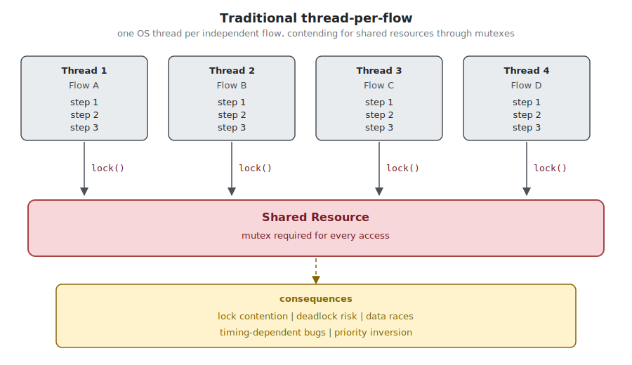
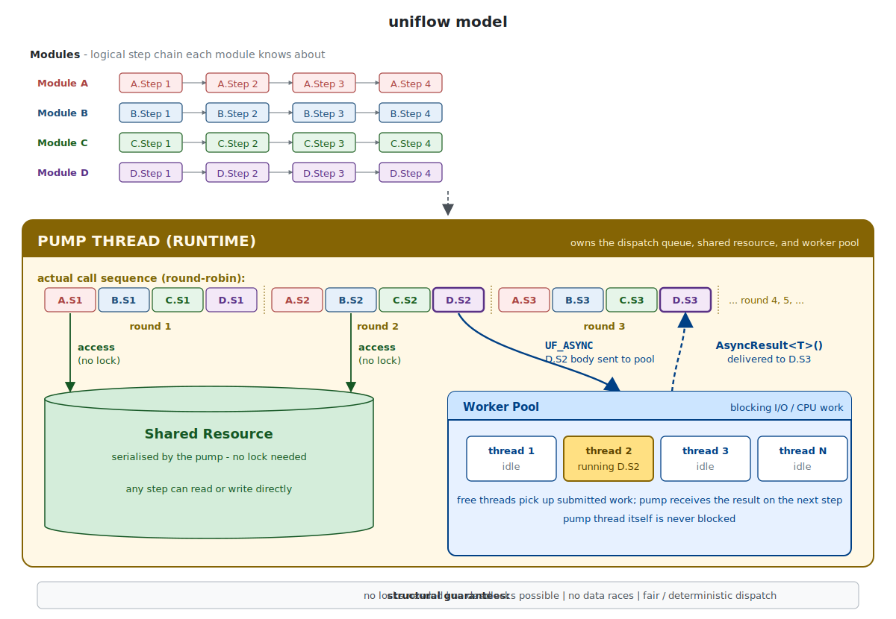

# uniflow-cpp

> 🌐 언어: **한국어** · [English](README.en.md)

> 단일 스레드 협력형 스케줄링(single-threaded cooperative scheduling) 위에 구축된 step 기반 비동기 프레임워크. C++17, 헤더 단일 파일.

---

## 개요

`uniflow-cpp`는 단일 스레드에서 협력적으로 진행되는 step 함수의 체인으로 모듈의 흐름을 표현하는 비동기 프레임워크다. 모든 모듈은 하나의 pump thread 위에서 round-robin으로 순회 실행되며, 블로킹 작업은 thread pool로 offload되어 결과만 다음 step에서 수신된다.

새로운 패러다임을 제시하는 것이 아니라, 오랜 기간 검증된 **reactor 패턴**과 **event loop + worker pool 모델**(Node.js / libuv 계보)을 C++ 타입 시스템 위에 *구조적으로 강제*하는 형태로 정리한 프레임워크다. 사용자가 임계 구역, 락 순서, 콜백 nesting을 의식하지 않고도 동일한 효과를 얻도록 설계되었다.

### 구조 비교

**(A) 전통적인 thread-per-flow 모델**

<p align="center">
  
</p>

각 흐름이 독립 스레드를 점유하며 공유 자원 접근마다 mutex를 거친다. 동시성 제어의 정확성을 *사용자가 직접 보장*해야 하는 모델이다.

**(B) uniflow 모델**

<p align="center">
  
</p>

모든 모듈의 step이 단일 pump thread 위에서 직렬화되어 실행된다. 공유 자원 접근이 자동으로 임계 구역이 되므로 lock이 필요 없고, 데드락과 timing 의존 버그가 구조적으로 발생하지 않는다. 블로킹 I/O 만 별도 worker pool로 격리되며, 결과는 다음 step의 `AsyncResult<T>()` 로 회수된다.

---

## 설계 의도

### 협력형 스케줄링으로 얻는 동시성

수십 개의 독립적 흐름이 동시 진행되는 것처럼 보이는 동시성은 진짜 멀티스레딩 없이도 달성 가능하다. 핵심은 각 step의 호출 주기가 충분히 짧고 공평하다는 점이다 — pump thread는 매 라운드 모든 활성 모듈을 한 번씩 방문하므로, 어떤 모듈도 다른 모듈을 영구히 차단하지 못한다. 결과적으로 N개의 모듈이 동시에 진행되는 것처럼 보이는 외관을 단일 스레드로 구현한다.

### 공유 자원 race condition의 원천적 제거

모든 step 본문이 동일한 스레드에서 직렬 실행된다는 점은 단순한 구현 디테일이 아니라 *모델의 핵심 속성*이다. 이로부터 다음이 따라온다:

- 모듈 간 공유 상태 접근이 자동으로 임계 구역이 된다 — mutex 없이 안전하다
- 데드락이 구조적으로 발생할 수 없다 — 락 자체가 존재하지 않으므로
- 멀티스레드 환경 특유의 timing 의존 버그가 발생하지 않는다 — 실행 순서가 결정적이다

이는 "락을 안전하게 거는 방법"을 가르치는 접근이 아니라, "락이 필요 없는 구조로 코드를 작성하게 만드는" 접근이다. 동시성 제어의 복잡도를 사용자가 풀어야 할 문제로 남기지 않고, 프레임워크 차원에서 제거한다.

### 블로킹 작업의 명시적 경계

순수 단일 스레드 모델만으로는 1초짜리 HTTP 호출 하나가 전체 pump를 정지시킨다. 이 경계는 `UF_ASYNC` 매크로로 구조적으로 분리된다 — 블로킹 작업은 *static 함수*로 작성하도록 강제되며, 결과는 반드시 *다음 step에서* 수신해야 한다. 컴파일 타임 `static_assert`가 instance 멤버 접근을 차단하여 cross-thread 데이터 공유 위험을 원천 차단한다.

### 흐름이 코드의 구조 그대로 보인다

step 함수의 이름과 호출 순서가 그 자체로 흐름의 사양서가 된다. `OnRoute_Validate` → `OnRoute_Charge` → `OnRoute_Confirm` 의 체인을 읽는 것만으로 처리 단계와 순서가 명확히 드러난다. 콜백 중첩이나 상태 변수 + switch 기반 state machine 없이도 비동기 흐름을 선형적으로 표현할 수 있다.

---

## 런타임

`Runtime`은 pump thread 1개와 executor(기본: `BS::thread_pool`) 1개를 묶은 실행 단위다. 모듈은 생성 시점에 부착될 runtime을 지정하며, 같은 runtime에 부착된 모든 step은 그 runtime의 단일 pump 위에서 직렬화되어 실행된다. lock-free 보장은 바로 이 직렬화에서 나온다.

다만 단일 runtime이 곧 전체 프로세스의 단일 스레드를 의미하지는 않는다. 서로 무관한 task group은 각자의 runtime을 가질 수 있고, 두 runtime은 독립된 pump 위에서 서로 다른 OS thread로 진행된다 — 실질적으로 multi-pump 아키텍처가 된다.

```cpp
uniflow::Runtime ui_rt;       // UI / 입력 처리 전용 pump
uniflow::Runtime net_rt;      // 네트워크 통신 전용 pump
uniflow::Runtime device_rt;   // 장비 제어 전용 pump
```

각 runtime 내부는 협력형 단일 스레드의 모든 이점(자동 임계 구역, lock 불필요, 결정적 실행 순서)을 그대로 가진다. "프레임워크가 단일 스레드에 묶는다"가 아니라 "어디까지를 lock-free 경계로 둘지 사용자가 정한다"가 정확한 표현이다.

### runtime 경계를 넘는 자원 접근

pump가 둘 이상이면 그 사이의 공유 자원은 다시 멀티스레드 문제가 된다. 모든 모듈에 락을 거는 것은 lock-free 라는 모델의 전제를 버리는 일이므로, uniflow는 락 대신 **접근을 한 pump 스레드로 모으는** 두 가지 수단을 제공한다.

**(1) `UF_POST` / `UF_POST_WAIT` — 콜백을 상대 pump로 던진다.** 다른 runtime(혹은 비-uniflow 코드, 일반 스레드)에서 어떤 runtime이 소유한 자원을 만져야 할 때, 그 자원을 직접 건드리는 대신 콜백을 해당 runtime에 post한다. 콜백은 그 runtime의 pump 스레드에서 실행되므로 락 없이 안전하다. 이것이 libuv의 `uv_async_send`, Qt의 `invokeMethod(Qt::QueuedConnection)`, Chromium의 `PostTask` 와 같은 패턴이다.

```cpp
// 다른 스레드에서: net_rt 가 소유한 상태를 안전하게 갱신
UF_POST(net_rt, [] { ConnectionTable::MarkStale(/* ... */); });

// 값을 회수해야 하면 UF_POST_WAIT - 호출 스레드가 결과를 기다린다
std::future<int> n = UF_POST_WAIT(net_rt, [] { return ConnectionTable::Count(); });
int count = n.get();
```

post된 콜백은 step/flow 모델 *밖*에서 도는 raw 콜백이므로 짧고 논블로킹이어야 한다(pump 독점 금지). `UF_POST_WAIT` 은 자기 자신을 구동하는 pump 스레드에서 부르면 데드락이므로 step 본문에서 호출하지 않는다(assert로 방지). 매크로는 호출 위치(`__FILE__`/`__LINE__`/`__FUNCTION__`)를 자동으로 붙여 observer 로깅에 넘긴다 — 매크로 없는 `net_rt.Post(...)` / `net_rt.PostAndWait(...)` 도 동작하지만 caller 정보는 비게 된다.

**(2) `UF_LINK` — 두 runtime을 한 pump 스레드로 합친다.** 공유가 빈번해서 post로는 부족할 때, 한 runtime을 다른 runtime에 link한다. link되면 상대 runtime은 자신의 observer / executor / config / 모듈 목록을 그대로 유지한 채 **pump 스레드만 driver 쪽으로 넘긴다**. 이후 두 runtime의 모든 step이 단일 스레드에서 직렬화되므로 둘 사이 공유 자원도 락이 필요 없어진다.

```cpp
uniflow::Runtime rt;
uniflow::Runtime sub_rt;
// ... sub_rt 에 모듈 부착 ...
UF_LINK(rt, sub_rt);   // 이제 rt 의 pump 가 sub_rt 모듈까지 구동
```

`Link` 는 **단방향**이다 — 한 번 합치면 분리(Unlink)할 수 없다. 합쳐진 뒤 양쪽 flow가 서로 의존을 만들었을 수 있어, 어느 모듈을 어느 pump로 되돌려도 안전한지 프레임워크가 보장할 수 없기 때문이다. 그래서 권장 기본값은 **runtime 하나로 시작**하고, 독립이 확실하며 병렬성이 실제로 필요할 때만 의식적으로 runtime을 쪼개는 것이다. (자세한 패턴은 [TUTORIAL.md 챕터 9](TUTORIAL.md) 참고.)

세 동작 모두 observer를 통해 로깅된다: post는 제출(`OnPostSubmitted`)과 실행(`OnPostExecuted`, queue 대기 시간 포함), link는 `OnLinked` 로 fire되며 각 콜백은 위 매크로가 잡은 caller 위치를 함께 받는다. 기본 `ConsoleObserver` 출력 예:

```
[rt#0          ] POST SUBMIT                  caller=net_worker.cpp:42 PollLoop()
[rt#0          ] POST RUN                     queue=0.67ms  caller=net_worker.cpp:42 PollLoop()
[rt#0          ] LINK                         rt#1 -> rt#0  caller=app.cpp:18 App::Start()
```

---

## 옵저버

step 기반 모델의 부수 효과로 **모니터링이 거의 공짜로 따라온다**. 모든 흐름이 step 함수의 호출 시퀀스로 환원되므로, pump가 step의 진입/이탈을 가로채는 자연스러운 지점이 된다. 사용자가 별도 trace 코드를 심지 않아도 다음이 자동으로 제공된다:

- **step 이동 흐름**: 어느 모듈의 어느 step에서 어느 step으로 옮겨갔는지의 전체 시퀀스
- **step 수행 시간**: 각 step body의 실행 시간 (min / max / avg)
- **step 머문 시간**: 다음 step으로 넘어가기 전까지 모듈이 해당 step에 머무른 시간 — async 응답이나 외부 이벤트 대기 구간의 길이가 그대로 측정된다
- **호출 횟수**: step 단위 카운터

### 예제 출력

위 [간단한 예제](#간단한-예제) 코드를 그대로 빌드해서 실행하면, 기본 `ConsoleObserver`가 두 모듈의 진행 상황을 별도 코드 없이 다음과 같이 기록한다 (시간 값은 예시):

```
[WorkTodo] FLOW START
[TickJob ] FLOW START
[WorkTodo] OnWork_Start                            ASYNC SUBMIT  DoSomething
[WorkTodo] OnWork_Start -> OnWork_AfterAsync       #00 elapsed=0.02ms  tick x1 avg=0.02ms min=0.02ms max=0.02ms
[TickJob ] OnTick_Begin -> OnTick_End              #00 elapsed=0.01ms  tick x1 avg=0.01ms min=0.01ms max=0.01ms
[TickJob ] OnTick_End                              #01 elapsed=0.01ms  tick x1 avg=0.01ms min=0.01ms max=0.01ms
[TickJob ] FLOW END  DONE  steps=#02  wall=0.05ms  step=0.02ms  async=0.00ms
[WorkTodo]                                         ASYNC DONE    DoSomething  wait=12.31ms
[WorkTodo] OnWork_AfterAsync -> OnWork_DoThis      #01 elapsed=12.34ms  tick x1 avg=0.03ms min=0.03ms max=0.03ms
[WorkTodo] OnWork_DoThis -> OnWork_DoThat          #02 elapsed=0.01ms  tick x1 avg=0.01ms min=0.01ms max=0.01ms
[WorkTodo] OnWork_DoThat                           #03 elapsed=0.01ms  tick x1 avg=0.01ms min=0.01ms max=0.01ms
[WorkTodo] FLOW END  DONE  steps=#04  wall=12.40ms  step=0.07ms  async=12.33ms  tick x4 avg=0.02ms min=0.01ms max=0.03ms
```

각 행에는 어느 모듈의 어느 step에서 어느 step으로 옮겨갔는지, step body가 몇 번 실행됐는지(`tick xN`), 그 step에서 보낸 wall time(`elapsed`), pump-thread 본문 시간 통계(`min`/`max`/`avg`)가 들어 있다. async 작업은 `ASYNC SUBMIT`/`ASYNC DONE` 으로 별도 기록된다.

특히 주목할 부분은 `DoSomething`이 12ms 걸리는 동안 같은 pump에 부착된 `TickJob`이 자기 흐름을 끝까지 진행해버린 점이다 — 단일 pump 위에서의 협력 실행이 그대로 시각화되어 있다.

### 인터페이스

기본 `ConsoleObserver` 대신 자체 trace/metrics 시스템에 연결하고 싶다면, `IUniflowObserver`를 상속해서 `Runtime`에 주입한다. 관심 있는 콜백만 override 하면 된다:

```cpp
// uniflow.hpp 내부 정의 (시그니처 단순화)
class IUniflowObserver
{
public:
    // 옵저버의 main signal - step 전이 + 누적 통계
    virtual void OnStepChanged (obj, prev_step, next_step, description,
                                step_ordinal,
                                elapsed_ms,      // 해당 step에 머문 시간
                                step_ticks) {}   // body 실행 횟수 + min/max/avg

    // async 작업 라이프사이클
    virtual void OnAsyncSubmitted(obj, step, job) {}
    virtual void OnAsyncCompleted(obj, job, wait_ms, had_error, timed_out) {}

    // 임계 알람 - threshold를 넘는 순간만 fire
    virtual void OnSlowCpuStep (obj, step, cpu_ms) {}       // 단일 step이 pump를 너무 오래 점유
    virtual void OnSlowAsync   (obj, job, wait_so_far_ms) {} // async가 너무 오래 미결

    // flow 결산
    virtual void OnFlowEnded   (obj, terminal_action,
                                wall_ms, total_step_ms, total_async_ms,
                                flow_ticks) {}              // flow 전체 tick 통계

    virtual void OnStepThrew   (obj, step, what, ...) {}    // 예외 (pump 밖으로 새지 않음)
    virtual void OnFlowStarted (obj, origin) {}

    // runtime 경계 트래픽 - caller(file/line/function) 동반
    virtual void OnPostSubmitted(runtime_index, blocking, caller) {} // Post/PostAndWait 제출 (호출 스레드)
    virtual void OnPostExecuted (runtime_index, blocking, queue_wait_ms, caller) {} // pump에서 실행
    virtual void OnLinked       (driver_index, linked_index, caller) {} // Link 성립
};

// Runtime 생성 시 주입
uniflow::Runtime rt{ uniflow::Runtime::Opts{
    .observer = std::make_unique<MyPrometheusObserver>()
}};
```

`OnSlowCpuStep` / `OnSlowAsync` 두 콜백은 `Config`에 지정한 임계값을 넘는 순간 자동으로 fire되므로, Prometheus / Slack / 사내 알람 시스템 등에 그대로 연결할 수 있다.

### 왜 자동으로 되는가

전통적인 thread-per-flow 모델에서는 "내 thread가 지금 어디서 무엇을 기다리는가"를 알기 위해 매 분기마다 사용자가 직접 로깅을 심어야 한다. uniflow는 모든 진행이 *step 호출 = 함수 진입*이라는 단일 형태로 통일되어 있어, pump 루프 한 군데에 measurement hook을 거는 것으로 모든 모듈, 모든 흐름의 측정이 끝난다. 프레임워크의 호출 컨벤션을 따르는 것 자체가 곧 트레이스 인프라를 활성화하는 행위다.

### 트러블슈팅에서의 효용

- **CPU 점유율이 갑자기 치솟는다** → step 수행 시간 통계를 정렬하면 의도치 않게 무거워진 step이 즉시 드러난다. pump가 단일 스레드이므로 "어느 step이 다른 step들의 진행까지 지연시키고 있는가"가 명확히 보인다.
- **flow가 느려진 것 같다** → 특정 step의 머문 시간이 평소보다 길어졌다면 async 응답이나 외부 이벤트 대기가 늘어졌다는 신호다.
- **특정 흐름이 멈췄다** → 마지막으로 진입한 step과 거기서 머문 시간만으로 hang 위치를 정확히 짚을 수 있다.

multi-thread 환경에서 보통 별도 APM 도구나 sampling profiler가 담당하던 일을 — 심지어 그 도구들이 잘 포착하지 못하는 *"코드는 돌고 있는데 일은 진행이 안 됨"* 상태까지 포함하여 — 프레임워크 자체가 의미 있는 단위(step) 기준으로 제공한다.

---

## 계보

이 모델의 가장 친숙한 실체는 **Node.js의 [libuv](https://libuv.org/)**다. libuv는 main thread에서 event loop를 돌리며 사용자 코드를 직렬 실행하고, 블로킹 I/O는 worker pool로 분리해 처리한 뒤 완료 콜백을 loop thread로 되돌린다. uniflow는 동일한 아키텍처를 C++ 상에 옮기되 callback 등록 방식 대신 *step 함수의 정적 체인*으로 표현 형태를 바꾼 결과다.

| libuv / Node.js | uniflow-cpp |
|---|---|
| event loop (main thread) | `Runtime`의 pump thread |
| `uv_queue_work` + worker pool | `UF_ASYNC` + `IExecutor` (기본: `BS::thread_pool`) |
| completion callback | 다음 step + `AsyncResult<T>()` |
| event handler 등록 | step 함수 멤버 (CRTP) |

추가적인 영향 계보:

- **[Reactor pattern](https://en.wikipedia.org/wiki/Reactor_pattern)** (POSA Vol.1) — 단일 dispatch loop의 형식적 정의
- **[Boost.Asio `io_context`](https://www.boost.org/doc/libs/release/doc/html/boost_asio/reference/io_context.html)** — 동일한 모델의 C++ 콜백 기반 구현
- **[Erlang/OTP actor 모델](https://en.wikipedia.org/wiki/Actor_model)** — message-driven, 공유 메모리 없는 협력적 진행
- **[Cooperative multitasking](https://en.wikipedia.org/wiki/Cooperative_multitasking)** — 선점형이 아닌 명시적 yield 기반 스케줄링의 일반 개념

---

## 포터빌리티

프레임워크 사용에 필요한 것은 단 하나의 헤더 파일(`uniflow.hpp`)이다.

- **빌드 시스템 비의존**: CMake, vcpkg, Conan, package manager 어떤 것도 요구하지 않는다. include path 설정만으로 충족된다.
- **외부 의존성 0**: 표준 라이브러리만 사용한다. thread pool 구현체(`BS::thread_pool`)는 헤더 내부에 인라인되어 있다.
- **C++17 최소 사양**: MSVC v142+, GCC 9+, Clang 10+ 에서 검증.
- **플랫폼 독립**: Windows / Linux / macOS 동일 컴파일. 일부 예제의 Win32 시각화만 플랫폼 의존이며, 프레임워크 자체는 무관하다.

도구 체인이 제한적인 임베디드 환경, 빌드 시스템 변경이 허용되지 않는 레거시 프로젝트, 단순 prototype까지 — 헤더 하나로 동일하게 사용 가능하다는 점은 실용적 가치가 크다.

---

## 간단한 예제

```cpp
#include "uniflow.hpp"

// CRTP: 모듈 클래스는 자기 자신을 템플릿 인자로 넘겨 Uniflow를 상속한다
class WorkTodo : public uniflow::Uniflow<WorkTodo>
{
    UF_UNIFLOW_IMPLEMENT(WorkTodo);   // 모듈 등록용 필수 매크로

public:
    explicit WorkTodo(uniflow::Runtime& rt)
        : uniflow::Uniflow<WorkTodo>(rt)
    {
    }

    // flow 진입 step (UF_START_FLOW가 호출하는 첫 함수)
    StepResult OnWork_Start()
    {
        UF_ASYNC(DoSomething, 42);             // blocking 작업 -> thread pool로 offload
        return UF_NEXT(OnWork_AfterAsync);     // 다음 step 예약 후 pump 양보
    }

private:
    StepResult OnWork_AfterAsync()
    {
        auto r = AsyncResult<int>();           // 이전 step의 async 결과 수신
        // do something with r ...
        return UF_NEXT(OnWork_DoThis);
    }

    StepResult OnWork_DoThis()
    {
        // do this ... (예: 상태 갱신, 조건 검사)
        return UF_NEXT(OnWork_DoThat);
    }

    StepResult OnWork_DoThat()
    {
        // do that ... (예: 결과 통지, 자원 해제)
        return Done();                         // flow 종료
    }

    // UF_ASYNC가 호출하는 함수는 static이어야 한다 (instance 멤버 접근은 compile error)
    static int DoSomething(int n);
};

// 역할이 다른 두 번째 모듈
class TickJob : public uniflow::Uniflow<TickJob>
{
    UF_UNIFLOW_IMPLEMENT(TickJob);

public:
    explicit TickJob(uniflow::Runtime& rt)
        : uniflow::Uniflow<TickJob>(rt)
    {
    }

    StepResult OnTick_Begin()
    {
        // do something ... (예: 주기적 sensor 읽기, heartbeat)
        return UF_NEXT(OnTick_End);
    }

    StepResult OnTick_End()
    {
        // do something else ...
        return Done();
    }
};

int main()
{
    uniflow::Runtime rt;             // pump thread + thread pool 1세트

    WorkTodo w{rt};                  // 모듈을 runtime에 부착
    TickJob  t{rt};                  // 같은 runtime -> 같은 pump 위에서 협력 실행

    UF_START_FLOW(w, OnWork_Start);  // 진입 step 호출 = flow 시작
    UF_START_FLOW(t, OnTick_Begin);

    w.WaitUntilIdle();               // 해당 모듈의 flow가 끝날 때까지 block
    t.WaitUntilIdle();
}
```

세 가지 핵심 요소가 보인다:

1. **`Runtime`**: pump thread 1개와 executor 1개를 소유. 여러 모듈(`WorkTodo`, `TickJob`)이 같은 runtime에 부착되어 단일 pump 위에서 병렬로 진행된다.
2. **Step 체인**: `OnWork_Start` → `OnWork_AfterAsync` → `OnWork_DoThis` → `OnWork_DoThat`. 흐름이 함수 이름과 호출 순서로 그대로 드러난다.
3. **`UF_ASYNC` + 다음 step**: 블로킹 작업이 pump를 점유하지 않으며, 결과는 다음 step의 `AsyncResult<T>()`로 수신된다.

---

## 문서

| 문서 | 대상 |
|---|---|
| [TUTORIAL.md](TUTORIAL.md) | 1-step 모듈부터 async 오케스트레이션까지 단계별 학습 |
| [EXAMPLES.md](EXAMPLES.md) | 5개의 실행 가능한 예제 프로젝트 |
| [DESIGN.md](DESIGN.md) | 설계 결정의 근거, 컨셉 변천, 트레이드오프 |
| [uniflow.hpp](uniflow.hpp) | 헤더 본체 (약 1,300줄, 상세 주석 포함) |

---

## 빌드

include path에 본 디렉토리만 지정하면 된다.

**MSVC**
```powershell
cl /std:c++17 /EHsc /I . examples\shared_ostream\*.cpp /Fe:shared_ostream.exe
```

**GCC / Clang**
```bash
g++ -std=c++17 -O2 -pthread -I . examples/shared_ostream/*.cpp -o shared_ostream
```

**Visual Studio**: `examples/*/<name>.vcxproj` 가 즉시 동작. `AdditionalIncludeDirectories=..\..\` 만 설정되어 있으면 충분하다.

---

## 데모


> 데모 영상은 `docs/videos/` 디렉토리에서 관리된다.

---

## 라이선스

[MIT](LICENSE). 내장된 BS::thread_pool 또한 MIT 라이선스이다.
