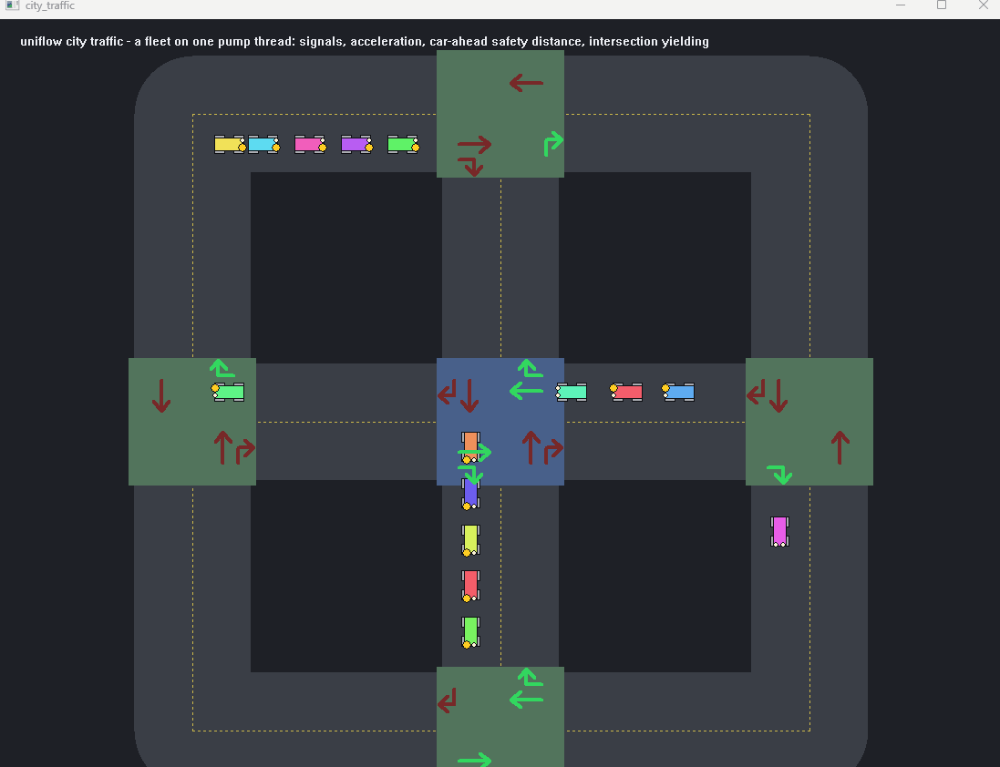

# uniflow

> Language: [한국어](README.kr.md) | **English**

[](https://github.com/splendidz/uniflow/actions/workflows/ci.yml)


```
1 header  |  0 external deps  |  C++17  |  no build system required
```

<p align="center">
  
  
</p>

<p align="center">
  <sub>Left: dozens of cars driving by the signals in <a href="cpp/examples/city_traffic/">city_traffic</a> &nbsp;|&nbsp; Right: two pickers running a line with no zone collision in <a href="cpp/examples/pick_and_place/">pick_and_place</a></sub><br>
  <sub>Both demos use <b>zero application-level threads</b>. Every flow runs cooperatively on a single pump thread.</sub>
</p>

---

## What uniflow is.

uniflow is a **tick-based FSM (finite state machine) asynchronous execution framework**. But not the traditional `switch`-with-`sleep` kind - it strips away the chronic drawbacks of the legacy tick-based FSM with **smart-polling**: instant reaction to events, and yielding the CPU when idle.

Every tick, the pump calls a module's current step once; the step runs to the end without blocking and returns only a step result for what to do next. A step never stops mid-way and runs whole on every call - this execution style is precisely what "run-to-completion" means.

If you have done equipment control or embedded work, the traditional tick-based FSM - ordered logic driven on a single thread - usually looks like this.

```cpp
// the traditional tick-based FSM approach
int step_no = 0;
while (running_)
{
    switch (step_no)
    {
    case 0: Init();   step_no++; break;   // the stage depends on a single integer
    case 1: if (Ready()) step_no++; break;
    case 2: Process(); step_no++; break;
    }
    sleep(10);   // always wait 10ms - the same while working and while idle
}
```

uniflow keeps this exact model, but lets the framework own two things. First, instead of a giant `switch` and an integer `step_no`, the flow is a **chain of named step functions**. Second, instead of a fixed `sleep(10)`, the pump **picks the wait to fit the moment**: no rest while transitions chain, the CPU nearly released while everyone polls for a condition, an immediate `Wake()` when an external event arrives. In short, **not a naive busy-loop.**

The goal of asynchronous processing overlaps with Boost.Asio and C++20 coroutines. The approach, however, differs.

- **Compared to Boost.Asio:** Asio is powerful, but adopting it means taking on a whole set of Asio-family types - `io_context` / `awaitable` / executors - and restructuring your code on top of them. It is specialized for the communication / socket domain. uniflow is **header only with zero dependencies**, and it does not change your existing objects (sockets, file IO, device handles, and so on). It leaves those objects as they are and formalizes only the **logic** that drives them into a step chain. There is no new class methodology to learn, so the adoption cost is low.

- **Compared to C++20 coroutines:** Coroutines are powerful because they are a language feature, but for that same reason they **cannot enforce a style**. How a coroutine is split into units varies from developer to developer, so over time the code fragments again. They also require C++20. uniflow runs on **C++17**, preserving version compatibility with existing projects, and it enforces state at the `task` level. A step jumping incorrectly into a step of another task is **prevented at the framework level (by type and structure)**.

| | Boost.Asio | C++20 coroutines | uniflow |
|---|---|---|---|
| Adoption cost | Learn a set of Asio types | Requires C++20 | 1 header, C++17, no deps |
| Existing objects | Absorbed into Asio types | Free, but no structure | Used as-is, unchanged |
| Development style | Communication-specific | Varies per developer | Enforced via flow / task |
| Observing execution flow | Build it yourself | Build it yourself | Observer built in |

### Core value: structure over async

The primary value of uniflow is not asynchrony itself, but that it **formalizes the way you develop**.

- **A flow / task skeleton that is enforced.** It guides developers to think in OOP terms - "this module is in exactly one state at a time," "this operation is composed of these steps." As features and code grow, everything keeps the same shape, so reviews stay consistent. Because code is written in the same structure regardless of a developer's skill or taste, the project is structurally prevented from turning into spaghetti over time.
- **A built-in observer.** The framework exposes, as a trace, which step your code is in right now, which operation is in progress, and where it slows down. The execution flow is visible without any separate instrumentation. This is an application-oriented design you can use directly for debugging and operational observability.
- **Use alongside other tools.** uniflow is, in the end, ordinary C++ code, so it can be used together with Asio or coroutines. You set the **development methodology** with uniflow, and bring in the right tool for areas like communication / IO within that frame.

In one line: **it asynchronizes your current logic in a formalized way, without touching your existing objects.**

---

## Quick Start

A **Flow** models "a unit that cannot be in two states at once." A car cannot drive forward and backward at the same time - one car is one `Flow` class. An event processor cannot handle two events at once - that processor is one `Flow`. A physical device, a channel, a logical exclusive resource - anything where only one operation can run at a time can be expressed as a `Flow`.

A **Task** is a concrete unit of work performed inside that `Flow`. For a car, "drive forward" and "drive backward" are Tasks; for an event processor, "handle event type A" is a Task. By declaring several Tasks on one `Flow`, the module's current role is determined by which Task is running. Tasks take turns but never run two at the same time - this is the core of `Flow` exclusivity.

Looking at the declaration and the body separately makes the structure clear at a glance. The declaration (`struct`) is the skeleton of the flow, and the body goes below it (in a real project, in a `.cpp`).

<details open>
<summary><b>C++</b></summary>

```cpp
#include "uniflow.hpp"

// One flow = one module. The Uniflow base registers itself with the pump.
class Flow_Example : public uniflow::Uniflow<Flow_Example>
{
public:
    explicit Flow_Example(uniflow::Runtime& rt)
        : uniflow::Uniflow<Flow_Example>(rt, "Example")
    {
        AddTask(ctx_);                 // wire the task to the flow (one line, once per task)
    }

    // task = a unit of work. It owns its own step member functions. public, so it can be entered from outside.
    struct MyTask : uniflow::Task<Flow_Example>
    {
        StepResult Entry() override { return Step1_Begin(); }   // designate the entry step

    private:                           // the remaining steps are private - reachable only via Entry/Next
        StepResult Step1_Begin();
        StepResult Step2_Work();
        StepResult Step3_Done();
    } ctx_;

private:
    bool ready_ = true;                // the flow holds the state; steps read it via flow()
};

uniflow::StepResult Flow_Example::MyTask::Step1_Begin()
{
    Describe("initialization complete");  // a one-line description left in the trace/log
    return Next(UF_FN(Step2_Work));    // advance to the next step of the same task
}

uniflow::StepResult Flow_Example::MyTask::Step2_Work()
{
    if (!flow().ready_) return Stay();  // re-poll this step until the condition holds (no blocking)
    return Next(UF_FN(Step3_Done));
}

uniflow::StepResult Flow_Example::MyTask::Step3_Done()
{
    return Done();                     // flow ends normally -> module goes idle
}

int main()
{
    uniflow::Runtime rt;               // spins up one pump thread
    Flow_Example     flow{rt};

    flow.ctx_.StartFlow();             // callable from any thread
    flow.WaitUntilIdle();
}
```

</details>

<details>
<summary><b>Python</b></summary>

```python
import uniflow


# One flow = one module. The Uniflow base registers itself with the pump.
class Flow_Example(uniflow.Uniflow):
    def __init__(self, rt):
        super().__init__(rt, name="Example")
        self.ready = True              # the flow holds the state; steps read it via flow()
        self.ctx = self.MyTask()
        self.AddTask(self.ctx)         # wire the task to the flow (one line, once per task)

    # task = a unit of work. It owns its own step methods.
    class MyTask(uniflow.Task):
        def Entry(self):
            return self.Step1_Begin()  # designate the entry step

        def Step1_Begin(self):
            self.Describe("initialization complete")  # a one-line description in the trace/log
            return self.Next(self.Step2_Work)         # advance to the next step of the same task

        def Step2_Work(self):
            if not self.flow().ready:
                return self.Stay()     # re-poll this step until the condition holds (no blocking)
            return self.Next(self.Step3_Done)

        def Step3_Done(self):
            return self.Done()         # flow ends normally -> module goes idle


def main():
    rt = uniflow.Runtime()             # spins up one pump thread
    flow = Flow_Example(rt)

    flow.ctx.StartFlow()               # callable from any thread
    flow.WaitUntilIdle()
    rt.stop()


if __name__ == "__main__":
    main()
```

</details>

<details>
<summary><b>C#</b></summary>

```csharp
using Uniflow;

// One flow = one module. The Module base registers itself with the pump.
sealed class Flow_Example : Module
{
    public bool Ready = true;          // the flow holds the state; steps read it via Flow
    public readonly MyTask Ctx;

    public Flow_Example(Runtime rt) : base(rt, "Example")
    {
        Ctx = new MyTask();
        AddTask(Ctx);                  // wire the task to the flow (one line, once per task)
    }

    // task = a unit of work. It owns its own step methods.
    public sealed class MyTask : Task<Flow_Example>
    {
        protected override StepResult Entry() => Step1_Begin();   // designate the entry step

        StepResult Step1_Begin()
        {
            Describe("initialization complete");  // a one-line description in the trace/log
            return Next(Step2_Work);              // advance to the next step of the same task
        }

        StepResult Step2_Work()
        {
            if (!Flow.Ready) return Stay();        // re-poll until the condition holds (no blocking)
            return Next(Step3_Done);
        }

        StepResult Step3_Done()
        {
            return Done();                         // flow ends normally -> module goes idle
        }
    }
}

static class Program
{
    public static void Main()
    {
        using var rt = new Runtime();              // spins up one pump thread
        var flow = new Flow_Example(rt);

        flow.Ctx.StartFlow();                      // callable from any thread
        flow.WaitUntilIdle();
    }
}
```

</details>

---

## The Message Pump

uniflow's unit of execution is the **pump thread**. The core idea is to **not create a thread per concurrent operation**. One `Runtime` owns one pump thread and, on that single thread, cooperatively drives the many flow modules attached to it, visiting each **once per round (round-robin)**. Dozens of flows share one thread. Because of this, shared resources need no lock (lock-free). This does not bind you to a single thread, either - if you need parallelism, create more `Runtime`s to add pump threads. A round proceeds in three stages.

<!-- diagram: pump round - drain Post -> run each module once -> choose sleep level -> repeat -->

1. **Drain Post** - first, empty the callbacks other threads enqueued via `Post()`. These callbacks run on the pump thread, so they can touch module state without a lock.
2. **Run each module once** - for each active module, call its current step body exactly once. A step returns exactly one of the intents `Stay` / `Next` / `Done` / `Fail` (round-robin, and never blocking).
3. **Choose a sleep level** - based on the busiest module this round, pick how long to wait until the next round.

| This round's result | Next wait | Meaning |
|---|---|---|
| At least one module **advanced** via `Next`/`Done`/`Fail` | `step_interval_sleep_ms` (default 0) | Consecutive transitions go straight to the next round without resting |
| All **polling** via `Stay` | `stay_sleep_ms` (default 20ms) | Normal polling cadence. CPU near 0 |
| All modules **idle** | `idle_sleep_ms` (default 1ms) | Pick up new work quickly |

Two things are key. First, because **every module runs on the same single thread, one at a time**, no locks are needed for shared state between modules (lock-free) - this is the foundation of nearly every advantage that follows. Second, the wait is not a fixed sleep but **decided by the situation**, so when work piles up it proceeds without waiting, and when idle it yields the CPU.

When an external event arrives (a network receive, a sensor interrupt), call `rt.Wake()` from any thread to immediately wake a waiting pump. You do not wait out the pump's sleep.

Thread boundaries are decided **by the designer, not by the unit of work**. Adding more `Runtime`s adds that many pump threads for genuine parallelism; conversely, merging two `Runtime`s onto one pump thread with `Runtime::Link()` makes both sides share the lock-free single-thread invariant again.

---

## Why uniflow

### 1. Smart Polling - a fundamental improvement on the switch/sleep structure

When implementing ordered logic on a single thread, a pattern was commonly used in the past.

```cpp
// the traditional tick-based FSM approach
int step_no = 0;
while (running_)
{
    switch (step_no)
    {
    case 0: Init();   step_no++; break;   // the stage depends on a single integer
    case 1: if (Ready()) step_no++; break;
    case 2: Process(); step_no++; break;
    }
    sleep(10);   // always wait 10ms - the same while working and while idle
}
```

This structure has five problems.

First, the polling period is fixed. Even when stage transitions happen back to back, the sleep gets in the way, hurting responsiveness.

Second, even when an external event arrives (a network receive, a sensor interrupt), the reaction is delayed by up to the sleep duration.

Third, because all the logic piles up inside a single switch block, the function grows bloated as stages increase.

Fourth, **nothing enforces a structure.** You are free to drive the stages with an integer or with a pile of bool flags, so the same logic ends up in completely different shapes from developer to developer. A review has to re-read the flow from scratch every time.

Fifth, **an explicit flow is not guaranteed.** Anywhere, you can assign `step_no = 1` to cut into the middle of a stage. It is hard to track which code jumps where, and the entry point blurs.

uniflow has the [message pump](#the-message-pump) choose the wait period to fit the situation (no rest during transitions, yield the CPU when idle), and nails each stage down as a named function, structurally eliminating the five problems above.

<!-- diagram: smart polling timeline - transition=0 sleep, polling=20ms, idle=1ms, immediate wake on event arrival -->

When an external event arrives, call `rt.Wake()` from any thread to immediately wake a sleeping pump.

```cpp
// Example. event-receiving thread (a separate thread): when an event arrives,
// immediately wake the runtime (message pump) so a uniflow task can act on it right away.
void OnNetworkReceived(Packet pkt)
{
    module_.SetPendingPacket(pkt);
    runtime_.Wake();         // wake the pump immediately - no sleep wait
}
```

---

### 2. Single Thread, Many Modules - cooperative execution on a single thread

<!-- diagram: Runtime structure (1 thread, N modules, thread pool) -->

One `Runtime` owns one pump thread. You can attach as many modules as you like onto this thread, and the pump runs every module once, in order, each round.

```cpp
uniflow::Runtime rt;            // one pump thread

Flow_XAxis    x_axis{rt};       // X-axis task set
Flow_YAxis    y_axis{rt};       // Y-axis task set
Flow_Conveyor conveyor{rt};     // Conveyor task set
Flow_Gripper  gripper{rt};      // Gripper task set

// four modules progress concurrently on one thread - no mutex
x_axis.ctx_home_.StartFlow();
conveyor.ctx_run_.StartFlow();
```

Modules on the same `Runtime` share the single-thread invariant, so accessing state between modules needs no mutex. Even in a round where the X axis is `Stay()` polling, the conveyor's stages advance.

Below is a concrete example showing two axes actually moving at the same time. There is only one thread, but while each module waits at its own step with `Stay()`, the other's step runs.

<details open>
<summary><b>C++</b></summary>

```cpp
// example: homing the X axis and Y axis at the same time
//
// the traditional way (needs two threads):
//   std::thread t1([]{ x_axis.GoHome(); });   // blocking function
//   std::thread t2([]{ y_axis.GoHome(); });
//   t1.join(); t2.join();
//
// the uniflow way (one thread):
//   x_axis.ctx_home_.StartFlow();
//   y_axis.ctx_home_.StartFlow();
//   rt.WaitAll();

// -- Flow_XAxis ---------------------------------
class Flow_XAxis : public uniflow::Uniflow<Flow_XAxis>
{
public:
    Flow_XAxis(uniflow::Runtime& rt) : uniflow::Uniflow<Flow_XAxis>(rt, "XAxis")
    {
        AddTask(ctx_home_);
    }

    struct Task_Home : uniflow::Task<Flow_XAxis>
    {
        StepResult Entry() override { return Step1_CmdMove(); }
    private:
        StepResult Step1_CmdMove()
        {
            flow().motor_.MoveTo(0);            // issue the move command only, return immediately
            return Next(UF_FN(Step2_Wait));
        }
        StepResult Step2_Wait()
        {
            if (!flow().motor_.InPosition())
                return Stay();                  // still moving - this round ends here
            return Done();                      // complete
        }
    } ctx_home_;

private:
    Motor motor_;
};

// Flow_YAxis has the same structure (omitted)

// -- run --
uniflow::Runtime rt;
Flow_XAxis x_axis{rt};
Flow_YAxis y_axis{rt};

x_axis.ctx_home_.StartFlow();   // start homing X
y_axis.ctx_home_.StartFlow();   // start homing Y (at the same time)

// each pump round:
//   Round 1: X.Step1(cmd move) -> Next  |  Y.Step1(cmd move) -> Next
//   Round 2: X.Step2(moving)   -> Stay  |  Y.Step2(moving)   -> Stay
//   Round N: X.Step2(done)     -> Done  |  Y.Step2(moving)   -> Stay
//   Round M: (X idle)          |  Y.Step2(done) -> Done
//
// while X waits at Stay(), Y runs, and vice versa.
// both axes move at the same time, with no mutex.

x_axis.WaitUntilIdle();
y_axis.WaitUntilIdle();
```

</details>

<details>
<summary><b>Python</b></summary>

```python
# example: homing the X axis and Y axis at the same time
#
# the traditional way (needs two threads):
#   t1 = threading.Thread(target=x_axis.go_home)   # blocking function
#   t2 = threading.Thread(target=y_axis.go_home)
#   t1.start(); t2.start(); t1.join(); t2.join()
#
# the uniflow way (one thread):
#   x_axis.ctx_home.StartFlow()
#   y_axis.ctx_home.StartFlow()
#   rt.WaitUntilIdle()

# -- Flow_XAxis ---------------------------------
class Flow_XAxis(uniflow.Uniflow):
    def __init__(self, rt):
        super().__init__(rt, name="XAxis")
        self.motor = Motor()
        self.ctx_home = self.Task_Home()
        self.AddTask(self.ctx_home)

    class Task_Home(uniflow.Task):
        def Entry(self):
            return self.Step1_CmdMove()

        def Step1_CmdMove(self):
            self.flow().motor.MoveTo(0)          # issue the move command only, return immediately
            return self.Next(self.Step2_Wait)

        def Step2_Wait(self):
            if not self.flow().motor.InPosition():
                return self.Stay()               # still moving - this round ends here
            return self.Done()                   # complete


# Flow_YAxis has the same structure (omitted)

# -- run --
rt = uniflow.Runtime()
x_axis = Flow_XAxis(rt)
y_axis = Flow_YAxis(rt)

x_axis.ctx_home.StartFlow()   # start homing X
y_axis.ctx_home.StartFlow()   # start homing Y (at the same time)

# each pump round:
#   Round 1: X.Step1(cmd move) -> Next  |  Y.Step1(cmd move) -> Next
#   Round 2: X.Step2(moving)   -> Stay  |  Y.Step2(moving)   -> Stay
#   Round N: X.Step2(done)     -> Done  |  Y.Step2(moving)   -> Stay
#
# while X waits at Stay(), Y runs, and vice versa.
# both axes move at the same time, with no lock.

x_axis.WaitUntilIdle()
y_axis.WaitUntilIdle()
```

</details>

<details>
<summary><b>C#</b></summary>

```csharp
// example: homing the X axis and Y axis at the same time
//
// the traditional way (needs two threads):
//   var t1 = new Thread(() => xAxis.GoHome());   // blocking function
//   var t2 = new Thread(() => yAxis.GoHome());
//   t1.Start(); t2.Start(); t1.Join(); t2.Join();
//
// the uniflow way (one thread):
//   xAxis.CtxHome.StartFlow();
//   yAxis.CtxHome.StartFlow();
//   rt.WaitUntilIdle();

// -- Flow_XAxis ---------------------------------
sealed class Flow_XAxis : Module
{
    public readonly Motor Motor = new Motor();
    public readonly Task_Home CtxHome;

    public Flow_XAxis(Runtime rt) : base(rt, "XAxis")
    {
        CtxHome = new Task_Home();
        AddTask(CtxHome);
    }

    public sealed class Task_Home : Task<Flow_XAxis>
    {
        protected override StepResult Entry() => Step1_CmdMove();

        StepResult Step1_CmdMove()
        {
            Flow.Motor.MoveTo(0);            // issue the move command only, return immediately
            return Next(Step2_Wait);
        }

        StepResult Step2_Wait()
        {
            if (!Flow.Motor.InPosition())
                return Stay();               // still moving - this round ends here
            return Done();                   // complete
        }
    }
}

// Flow_YAxis has the same structure (omitted)

// -- run --
using var rt = new Runtime();
var xAxis = new Flow_XAxis(rt);
var yAxis = new Flow_YAxis(rt);

xAxis.CtxHome.StartFlow();   // start homing X
yAxis.CtxHome.StartFlow();   // start homing Y (at the same time)

// each pump round:
//   Round 1: X.Step1(cmd move) -> Next  |  Y.Step1(cmd move) -> Next
//   Round 2: X.Step2(moving)   -> Stay  |  Y.Step2(moving)   -> Stay
//   Round N: X.Step2(done)     -> Done  |  Y.Step2(moving)   -> Stay
//
// while X waits at Stay(), Y runs, and vice versa.
// both axes move at the same time, with no lock.

xAxis.WaitUntilIdle();
yAxis.WaitUntilIdle();
```

</details>

Genuinely blocking work (I/O, heavy computation) is delegated to the built-in thread pool via `SubmitAsync`, which wakes the pump on completion. The pump thread itself is never blocked.

Creating multiple `Runtime`s yields multiple pump threads. With `Runtime::Link()` you can also merge two runtimes onto a single pump thread.

---

### 3. Flat Structure - flat code structure and team consistency

Implementing ordered logic by hand typically nests flags and conditionals until the code depth grows deep. Even experienced developers struggle to avoid this once time passes and requirements accumulate.

```cpp
// a typical flag-based structure - nesting and flags explode as stages and exception paths grow
void Update()
{
    if (estop_)
    {
        // e-stop can arrive at any stage - every progress flag must be rolled back here
        connecting_ = false;
        cmd_sent_   = false;
        waiting_ack_ = false;
        // forgot draining_ - a bug that waits for a ghost ack next cycle
        if (!device_.IsSafe())
        {
            return;
        }
        estop_ = false;
    }

    if (!connected_)
    {
        if (!connecting_)
        {
            device_.BeginConnect();
            connecting_   = true;
            connect_timer_.Restart();
        }
        else if (device_.IsConnected())
        {
            connected_  = true;
            connecting_ = false;
        }
        else if (connect_timer_.Passed(5000ms))
        {
            if (++reconnect_count_ > 3)
            {
                fault_ = true;       // but fault_ is read not at the top of the function, but way down there
            }
            connecting_ = false;     // reset to retry - and where is reconnect_count_ reset?
        }
    }
    else if (!cmd_sent_)
    {
        if (input_.HasRequest() && !draining_)
        {
            device_.Send(input_.Take());
            cmd_sent_    = true;
            waiting_ack_ = true;     // an implicit rule that the two flags must always move as a pair
            cmd_timer_.Restart();
        }
    }
    else if (waiting_ack_)
    {
        if (device_.HasAck())
        {
            // success - if even one of these 5 lines is missing, the next command is blocked forever
            cmd_sent_     = false;
            waiting_ack_  = false;
            retry_count_  = 0;
            reconnect_count_ = 0;
            draining_     = input_.HasRequest();
        }
        else if (cmd_timer_.Passed(3000ms))
        {
            if (++retry_count_ < 3)
            {
                cmd_sent_    = false;   // mimic returning to Step3 with a combination of flags
                waiting_ack_ = false;
            }
            else if (!fault_)
            {
                fault_ = true;
                connected_ = false;    // roll back even the connection - then what about reconnect_count_...?
            }
        }
    }
    // what about handling fault_? what if estop_ and fault_ are simultaneous? no branch spells it out
}
```

In uniflow, the same logic becomes one named function per stage.

```cpp
StepResult Step1_Connect()
{
    flow().device_.BeginConnect();
    return Next(UF_FN(Step2_WaitConnected));
}

StepResult Step2_WaitConnected()
{
    if (!flow().device_.IsConnected()) return Stay();   // re-poll this step until connected
    return Next(UF_FN(Step3_WaitRequest));
}

StepResult Step3_WaitRequest()
{
    if (!flow().input_.HasRequest()) return Stay();
    flow().device_.Send(flow().input_.Take());
    return Next(UF_FN(Step4_WaitAck));
}

StepResult Step4_WaitAck()
{
    if (flow().device_.HasAck()) { flow().OnSuccess(); return Done(); }
    return StayUntil(3000ms, UF_FN(Step5_Timeout));     // no ack within 3s -> go to the timeout step
}

StepResult Step5_Timeout()
{
    if (++retry_count < 3) return Next(UF_FN(Step3_WaitRequest));   // retry_count is a task member
    flow().OnFail();
    return Fail();
}
```

What exploded in the flag version above - `connected_`/`connecting_`/`cmd_sent_`/`waiting_ack_`/`draining_`/`fault_`/`estop_` implicitly responsible for resetting one another, with e-stop and fault able to cut in at any branch, so "forgetting a reset becomes a bug" - is gone. Brace depth is fixed, and each state becomes one named step. Even cross-cutting paths like e-stop/fault are expressed not as flags but as explicit transitions (`StayUntil`/`Next`/`Fail`), so adding a stage means adding one function and changing only its wiring, leaving the rest of the stages untouched.

This structure also helps in team work. Because every developer expresses logic in the same pattern, the stage structure is grasped immediately in code review. Because the framework enforces the pattern, consistent code results regardless of experience level.

---

### 4. Built-in Tracing - built-in tracing and observability

Because every execution reduces to the single shape "a step function was called once," a single measurement point inside the pump observes the entire flow. Using the default `ConsoleObserver`, the following information is recorded automatically, with no separate logging code.

```
[JobWorker    ] FLOW START  caller=main.cpp:42 main()
[JobWorker    ] Entry -> Step2_Validate                         #00 elapsed=0.01ms  tick x8 avg=0.01ms
[JobWorker    ]                 ASYNC SUBMIT  CallApi
[JobWorker    ]                 ASYNC DONE    CallApi  wait=124.38ms
[JobWorker    ] Step2_Validate -> Step3_WaitSave  inserted=3000  #01 elapsed=124.42ms tick x1 avg=0.03ms
[JobWorker    ] Step3_WaitSave -> Done                           #02 elapsed=18.71ms  tick x1
[JobWorker    ] FLOW END  DONE  steps=#02  wall=143.21ms  step=0.07ms  async=143.09ms  tick x10 avg=0.01ms
```

Each line contains the transition from the previous stage to the next, the time spent in that stage, body run statistics, async wait time, and the description set with `Describe()`.

Slow-step alarms, slow-async-job alarms, and round-level profiling are also configurable.

```cpp
uniflow::Runtime::Opts opts;
opts.config.slow_step_threshold_ms  = std::chrono::milliseconds(10);   // warn when a step body exceeds 10ms
opts.config.slow_async_threshold_ms = std::chrono::milliseconds(500);  // warn when an async job exceeds 500ms
uniflow::Runtime rt{std::move(opts)};
```

To connect to your own metrics system or alerting channel, derive from `IUniflowObserver` and override only the hooks you need. Because the measurement point is in one place rather than scattered throughout the logic code, instrumentation code and business logic stay separated.

---

### 5. Task - unit-based type safety + explicit transitions (Type-safe Units)

As steps grow numerous, it becomes hard to tell which step belongs to which logical operation. uniflow groups related steps into a struct deriving from `uniflow::Task<Flow>`. A task directly owns its own step member functions, so each step belongs, by definition, to its task.

<details open>
<summary><b>C++</b></summary>

```cpp
class Flow_PickPlace : public uniflow::Uniflow<Flow_PickPlace>
{
public:
    explicit Flow_PickPlace(uniflow::Runtime& rt)
        : uniflow::Uniflow<Flow_PickPlace>(rt, "PickPlace")
    {
        AddTask(ctx_pick_);
        AddTask(ctx_place_);
    }

    // public - the orchestrator enters the desired unit directly via ctx.StartFlow()
    struct Task_Pick : uniflow::Task<Flow_PickPlace>
    {
        int part_id = 0;                               // state shared by the steps within the task
        StepResult Entry() override { return Step1_MoveToSource(); }

    private:
        StepResult Step1_MoveToSource()
        {
            part_id = flow().source_.NextPart();
            return Next(UF_FN(Step2_WaitAtSource));
        }

        StepResult Step2_WaitAtSource()
        {
            if (!flow().arm_.IsReady()) return Stay();
            flow().ctx_place_.slot = flow().dest_.FreeSlot();
            return StartTask(flow().ctx_place_);       // switch to Task_Place
        }
    } ctx_pick_;

    struct Task_Place : uniflow::Task<Flow_PickPlace>
    {
        int slot = 0;
        StepResult Entry() override { return Step1_MoveToDest(); }

    private:
        StepResult Step1_MoveToDest()
        {
            flow().arm_.MoveTo(flow().dest_pos_[slot]);
            return Next(UF_FN(Step2_Release));
        }

        StepResult Step2_Release() { flow().arm_.Release(); return Done(); }
    } ctx_place_;
};
```

</details>

<details>
<summary><b>Python</b></summary>

```python
class Flow_PickPlace(uniflow.Uniflow):
    def __init__(self, rt):
        super().__init__(rt, name="PickPlace")
        self.ctx_pick = self.Task_Pick()
        self.AddTask(self.ctx_pick)
        self.ctx_place = self.Task_Place()
        self.AddTask(self.ctx_place)

    # public - the orchestrator enters the desired unit directly via ctx.StartFlow()
    class Task_Pick(uniflow.Task):
        def __init__(self):
            super().__init__()
            self.part_id = 0                               # state shared by the steps in the task

        def Entry(self):
            return self.Step1_MoveToSource()

        def Step1_MoveToSource(self):
            self.part_id = self.flow().source.NextPart()
            return self.Next(self.Step2_WaitAtSource)

        def Step2_WaitAtSource(self):
            if not self.flow().arm.IsReady():
                return self.Stay()
            self.flow().ctx_place.slot = self.flow().dest.FreeSlot()
            return self.StartTask(self.flow().ctx_place)   # switch to Task_Place

    class Task_Place(uniflow.Task):
        def __init__(self):
            super().__init__()
            self.slot = 0

        def Entry(self):
            return self.Step1_MoveToDest()

        def Step1_MoveToDest(self):
            self.flow().arm.MoveTo(self.flow().dest_pos[self.slot])
            return self.Next(self.Step2_Release)

        def Step2_Release(self):
            self.flow().arm.Release()
            return self.Done()
```

</details>

<details>
<summary><b>C#</b></summary>

```csharp
sealed class Flow_PickPlace : Module
{
    public readonly Task_Pick CtxPick;
    public readonly Task_Place CtxPlace;

    public Flow_PickPlace(Runtime rt) : base(rt, "PickPlace")
    {
        CtxPick = new Task_Pick();
        AddTask(CtxPick);
        CtxPlace = new Task_Place();
        AddTask(CtxPlace);
    }

    // public - the orchestrator enters the desired unit directly via Ctx.StartFlow()
    public sealed class Task_Pick : Task<Flow_PickPlace>
    {
        public int PartId;                                 // state shared by the steps in the task
        protected override StepResult Entry() => Step1_MoveToSource();

        StepResult Step1_MoveToSource()
        {
            PartId = Flow.Source.NextPart();
            return Next(Step2_WaitAtSource);
        }

        StepResult Step2_WaitAtSource()
        {
            if (!Flow.Arm.IsReady()) return Stay();
            Flow.CtxPlace.Slot = Flow.Dest.FreeSlot();
            // In C#, StartTask returns StartResult (not StepResult), so a step cannot
            // "return StartTask(...)". Finish this task and let the orchestrator launch
            // Task_Place via StartFlow() the way the pick_and_place example does.
            return Done();
        }
    }

    public sealed class Task_Place : Task<Flow_PickPlace>
    {
        public int Slot;
        protected override StepResult Entry() => Step1_MoveToDest();

        StepResult Step1_MoveToDest()
        {
            Flow.Arm.MoveTo(Flow.DestPos[Slot]);
            return Next(Step2_Release);
        }

        StepResult Step2_Release()
        {
            Flow.Arm.Release();
            return Done();
        }
    }
}

// orchestrate Pick -> Place: Pick finishes, then the orchestrator launches Place.
//   flow.CtxPick.StartFlow();  flow.WaitUntilIdle();
//   flow.CtxPlace.StartFlow(); flow.WaitUntilIdle();
```

</details>

A step is a member of its own task and so belongs to it, and `Next` points only to a sibling step. To move to another unit, cross the task boundary explicitly with `StartTask`. Because the unit boundary shows up directly in the code structure, it never gets blurry which step belongs to which unit.

**The key point is that transitions are pinned explicitly in the code.** Each step names its next step directly with `Next(UF_FN(...))`, and that target can only be a sibling step of the same task. So **just by scanning the function declaration list**, it becomes clear in what order the logic must be called - where it starts (`Entry`) and where it flows. There is no way to cut into the middle of a stage from outside (steps are `private`; entry is only via `Entry`), so there are no hidden entry points and no untraceable jumps. The flow is fixed by type and declaration, which greatly improves readability.

Each task calls `OnEnter()` on entry, so per-unit initialization (timer reset, counter reset) can be handled here. With `Trajectory()` you can also query the history of visited stages within the unit and the time spent in each.

---

### 6. Time Control - simulator scale/freeze (Scale & Freeze)

Implementing a simulator with uniflow gives you **the speed-up and pause of the entire simulation with no extra implementation.** All time-based logic - step timeouts (`StayUntil`), elapsed/settle timers (`UFTimer`, `HeldFor`) - follows the single logical clock the `Runtime` holds. Scaling or freezing that one clock makes every flow above speed up or stop together.

<!-- diagram: one logical clock drives every flow's StayUntil/UFTimer (SetScale/Freeze propagates to all) -->

```cpp
uniflow::Runtime rt;

rt.clock().SetScale(10.0);   // 10x simulation - a 3s timeout fires at 0.3s
rt.clock().Freeze();         // full stop (E-Stop/pause). all timeout countdowns halt
// ... after inspection/recovery
rt.clock().Resume();
```

Binding a timer to this clock makes it follow the scale/freeze directly.

```cpp
uniflow::UFTimer settle{rt.clock()};   // bound to the runtime's logical clock
// ... inside a step
if (settle.HeldFor(sensor.IsReady(), 50ms)) return Next(UF_FN(Step2_Go));
```

The logical clock applies only to logical waits. The actual I/O wait of `SubmitAsync` and the pump's own sleep follow the real wall clock, so applying a scale does not also speed up a network call - the two clocks can be mixed with no conflict.

---

## Async (SubmitAsync) - asynchronous work handling

The most common misconception about the single-thread model is that the pump stalls on long-running work. In practice it does not. uniflow's model is **the same idea as the event loop of libuv / Node.js**. The pump thread never blocks; heavy work (I/O, computation) is thrown to the built-in thread pool, and its completion is received back as a single event. Meanwhile every other module on the same `Runtime` keeps running without stopping.

In fact, **the longer the work takes, the easier it is to manage.** The step that throws the work and the step that receives the result are separated, so the flow is explicit; progress/timeout/failure are left right in the trace; and the continuation step that receives the result also runs on the pump thread, so there is no contention over shared state.

If a step body blocks directly, the entire pump thread stops, so blocking work is delegated to the thread pool with `SubmitAsync`. `SubmitAsync` **returns an `AsyncId`** that identifies that work (or `0` if rejected). Pass this id to the step that will read the result, and receive it there with `AsyncResult<T>(id)`.

<details open>
<summary><b>C++</b></summary>

```cpp
StepResult Step1_FetchData()
{
    Describe("receiving data");
    // SubmitAsync returns an AsyncId. id 0 means rejected (e.g. in-flight cap exceeded).
    AsyncId job = SubmitAsync(UF_FN(DoFetch), std::chrono::milliseconds(5000), url);
    if (job == 0)
    {
        return Fail();
    }
    return Next(UF_FN(Step2_ProcessData), job);   // pass the id to the next step
}

StepResult Step2_ProcessData(AsyncId job)
{
    auto r = AsyncResult<std::string>(job);
    if (r.pending())                            // still in progress -> poll
    {
        return StayUntil(5000ms, UF_FN(Step_FetchGaveUp));
    }
    if (r.is_timeout() || r.failed() || !r.ok())
    {
        flow().log_.Error("fetch failed");
        return Fail();
    }
    data = *r.return_value;                     // populated only when state == Done
    return Next(UF_FN(Step3_Save));
}

StepResult Step_FetchGaveUp()
{
    ClearAsync();                               // abandon the unfinished worker (observer warning) then proceed
    return Fail();
}

// runs on the thread pool, so it must be static - cannot access instance members
static std::string DoFetch(std::string url) { return http_.Get(url); }
```

</details>

<details>
<summary><b>Python</b></summary>

```python
def Step1_FetchData(self):
    self.Describe("receiving data")
    # SubmitAsync returns an AsyncId. id 0 means rejected (e.g. in-flight cap exceeded).
    job = self.SubmitAsync(self.DoFetch, "DoFetch", 5.0, self.url)
    if job == 0:
        return self.Fail()
    return self.Next(self.Step2_ProcessData, job)   # pass the id to the next step

def Step2_ProcessData(self, job):
    r = self.AsyncResult(job)
    if r.pending():                                 # still in progress -> poll
        return self.StayUntil(5.0, self.Step_FetchGaveUp)
    if r.is_timeout() or r.failed() or not r.ok():
        self.flow().log.Error("fetch failed")
        return self.Fail()
    self.data = r.return_value                       # populated only when state == Done
    return self.Next(self.Step3_Save)

def Step_FetchGaveUp(self):
    self.ClearAsync()                                # abandon the unfinished worker then proceed
    return self.Fail()

# runs on the thread pool, so it is a static worker - no instance access
@staticmethod
def DoFetch(url):
    return Http.Get(url)
```

</details>

<details>
<summary><b>C#</b></summary>

```csharp
// _job is a task field that carries the AsyncId across steps (Next takes no args).
int _job;

StepResult Step1_FetchData()
{
    Describe("receiving data");
    // SubmitAsync returns an AsyncId. id 0 means rejected (e.g. in-flight cap exceeded).
    _job = SubmitAsync(() => (object?)DoFetch(_url), "DoFetch", 5.0);
    if (_job == 0)
    {
        return Fail();
    }
    return Next(Step2_ProcessData);                 // the carried id is read in the next step
}

StepResult Step2_ProcessData()
{
    var r = AsyncResult<string>(_job);
    if (r.Pending)                                  // still in progress -> poll
    {
        return StayUntil(5.0, Step_FetchGaveUp);
    }
    if (r.IsTimeout || r.Failed || !r.Ok)
    {
        Flow.Log.Error("fetch failed");
        return Fail();
    }
    _data = r.ReturnValue;                          // populated only when state == Done
    return Next(Step3_Save);
}

StepResult Step_FetchGaveUp()
{
    ClearAsync();                                   // abandon the unfinished worker then proceed
    return Fail();
}

// runs on the thread pool, so it is a static worker - no instance access
static string DoFetch(string url) => Http.Get(url);
```

</details>

After `SubmitAsync`, the pump does not block that module. The step that threw the work moves straight to the next step, and the step waiting for the result polls `AsyncResult<T>(id)` and, if `Pending`, `Stay`s on its own. As a result, **you can receive the result at any later step, not just the one right after the submit** - inserting other steps in between is no problem. When the work finishes, the worker thread calls `rt.Wake()` to wake the pump immediately, so it is caught right after completion without waiting for a polling period.

The `AsyncOutcome<T>` that `AsyncResult<T>(id)` returns has five states: `NotFound` (invalid/cleaned-up/0 id), `Pending`, `Done` (result in `return_value`), `Failed`, `TimedOut`. An invalid id naturally falls to `NotFound`, flowing into the error branch with no null dereference.

You can **throw multiple jobs at once** and wait for them all in one step. `AnyAsyncPending()` is the join-all primitive (set the deadline yourself with `StayUntil`).

```cpp
StepResult Step1_KickProbes()
{
    a_ = SubmitAsync(UF_FN(ReadSensorA));      // two AsyncIds in progress at once
    b_ = SubmitAsync(UF_FN(ReadSensorB));
    if (a_ == 0 || b_ == 0)
    {
        return Fail();
    }
    return Next(UF_FN(Step2_Join), a_, b_);
}

StepResult Step2_Join(AsyncId a, AsyncId b)
{
    if (AnyAsyncPending())                      // poll until both finish
    {
        return StayUntil(2000ms, UF_FN(Step_ProbeTimeout));
    }
    use(*AsyncResult<int>(a).return_value, *AsyncResult<bool>(b).return_value);
    return Done();
}
```

A timeout does not forcibly kill the worker (in C++ there is no safe way to kill a thread). `TimedOut` means "stop waiting," and the worker keeps running in the background until it finishes naturally. If cleanup is needed, discard the slot with `ClearAsync()` - the unfinished worker is abandoned (its result discarded) and `OnAsyncAbandoned` fires per worker so the leak is visible in the log. To prevent throwing work without bound, when a flow's concurrent in-flight count exceeds `Config::max_inflight_async`, `SubmitAsync` returns `0` and warns via `OnAsyncHighWater`.

When the polled condition itself needs a timeout, use `StayUntil` the same way.

```cpp
StepResult Step1_WaitSensor()
{
    if (flow().sensor_.IsReady()) return Next(UF_FN(Step2_Process));
    return StayUntil(3000ms, UF_FN(Step3_SensorTimeout));  // when 3s is exceeded, go to the timeout step
}
```

---

## Where it fits

uniflow is not limited to equipment control. It suits any structure with order and a mix of synchronous/asynchronous processing, such as the following.

| Domain | Example application |
|---|---|
| Equipment and motion control | Pick-and-place sequences, axis moves and sensor waits, CNC process flow |
| Backend job processing | Receive a job from a queue, validate, call an external API, retry, store the result |
| Data pipeline | Open a file, parse, schema-validate, dedupe check, store to DB, report |
| Protocol handler | Connect, handshake, send/receive commands, handle reconnection |
| Simulation | Many agents read shared state and move, lock-free |

**When it is not a good fit**
- CPU-bound parallel computation that saturates every core (a single pump uses one core. Heavy computation can be delegated to the pool with `SubmitAsync`, but if pure parallel computation is the goal, a separate tool is better)
- A third-party blocking loop that cannot yield cooperatively (solvable by isolating it with `SubmitAsync`)
- An ultra-low-latency path where microsecond delays are critical (the cooperative round period becomes the floor)

---

## Examples

Six reference examples are provided **identically in C++ / Python / C#**. Each one focuses on a
specific uniflow capability - the "Key reference" line below is what to study in that example. The numbers
are identifiers, not a recommended learning order; if you are new, try 6 -> 3 -> 5 -> 4 -> 2 -> 1.

> Rendering: the two flagships (1, 2) are **dual renderers** - a Win32 GUI on Windows, an ANSI
> console on Linux/macOS (`UF_RENDER=console` forces console on Windows too). The rest are console
> everywhere and run with nothing to install. The Python and C# ports are all console.

### 1. pick_and_place - the reference project

<p align="center">
  
</p>

**Key reference: Task<Flow> unit structure + orchestrator state polling + async-poll acks.** A virtual CNC
line - a Load picker carries a part A->B, a Stage machines it at B, an Unload picker moves it B->C.
An orchestrator keeps the two pickers from ever sharing zone B, and that mutual exclusion is a plain
member read (not a lock) because everything is on one pump. The Stage holds three tasks
(Prepare/Process/Cleanup) and gets command acks via `SubmitAsync` + `AsyncResult` polling with a
`StayUntil` timeout.

Languages: [C++](cpp/examples/pick_and_place/README.md) (dual render) | [Python](python/examples/pick_and_place.py) | [C#](cs/examples/pick_and_place/)

### 2. city_traffic - a city on one thread

<p align="center">
  
</p>

**Key reference: dozens of modules cooperating on one thread + lock-free shared state + a pure-polling state
machine with no async.** 15 cars, each an independent module, accelerate / stop / turn while watching
shared lights and the car ahead; each intersection is a module too. Zero application-level threads -
the shared World needs no locks because one thread touches it. A car's driving loop is a
`Step_Cruise -> Wait -> Cross -> Turn` state machine.

Languages: [C++](cpp/examples/city_traffic/README.md) (dual render) | [Python](python/examples/city_traffic.py) | [C#](cs/examples/city_traffic/)

### 3. simulator - time control (scale / freeze)

**Key reference: VirtualClock scale/freeze + the renderer is just a flow + lock-free snapshot.** Five runner
flows and a renderer flow share one pump and one logical clock. `pause` calls `clock.Freeze()` once
to stop every runner at the same instant; `speed <n>` calls `clock.SetScale(n)` once to rescale the
whole field. The renderer draws on a real-time timer, so when the clock is frozen the runners stop
yet the dashboard keeps redrawing and shows `[PAUSED]`.

Languages: [C++](cpp/examples/simulator/README.md) (console) | [Python](python/examples/simulator.py) | [C#](cs/examples/simulator/)

### 4. message_dispatch - routing by kind

**Key reference: dispatch by message kind + lock-free shared mailbox + blocking work via async poll.** Two
spawners (a professor and a friend) push messages into a shared mailbox; a student module pops them
one at a time and routes by kind (assignment / play) into different step chains. The mailbox is
lock-free (one pump). Blocking work like "study hours" goes to the pool via `SubmitAsync` and is
polled.

Languages: [C++](cpp/examples/message_dispatch/README.md) (console) | [Python](python/examples/message_dispatch.py) | [C#](cs/examples/message_dispatch/)

### 5. queue_drain - producer / consumer

**Key reference: single-thread producer/consumer + park/relaunch wake.** A sender pushes items into a queue
in bursts; a receiver drains them one at a time. When the queue empties the receiver `Done()`s and
**parks**; the sender relaunches it with `StartFlow()` on the next burst. All on one pump, so the
queue needs no lock.

Languages: [C++](cpp/examples/queue_drain/README.md) (console) | [Python](python/examples/queue_drain.py) | [C#](cs/examples/queue_drain/)

### 6. shared_ostream - lock-free shared state (minimal)

**Key reference: one pump means shared state is lock-free.** Two writer modules take turns writing into one
buffer. Because a single thread touches it there is no lock at all, yet the output order is exactly
preserved (proven by a PASS check). The smallest example, finite.

Languages: [C++](cpp/examples/shared_ostream/README.md) (console) | [Python](python/examples/shared_ostream.py) | [C#](cs/examples/shared_ostream/)

### (+) weather_llm - real async I/O (C++ only)

**Key reference: two async stages chained via SubmitAsync poll; the pump never blocks on network I/O.** It
HTTPS-GETs the KMA page, then POSTs that HTML to Gemini for a summary. Both blocking network calls go
through `SubmitAsync` -> `AsyncResult` polling so the pump keeps running. Because HTTP/LLM clients
differ per language, this example is **C++/WinHTTP only** and is not ported to Python/C#.
`GEMINI_API_KEY` is optional (without it, it prints a slice of the HTML).

Languages: [C++](cpp/examples/weather_llm/README.md) (console, Windows)

The full gallery lives in [cpp/EXAMPLES.md](cpp/EXAMPLES.md).

---

## Learn more

| Doc | Contents |
|---|---|
| [cpp/TUTORIAL.md](cpp/TUTORIAL.md) | A step-by-step tutorial by concept, from a one-step module to multi-runtime orchestration |
| [cpp/EXAMPLES.md](cpp/EXAMPLES.md) | Example gallery and recommended reading order |
| [cpp/uniflow.hpp](cpp/uniflow.hpp) | The header itself, with detailed comments on every public API |

---

## Build

Add the `cpp/` directory to your include path; that is all. There is no separate build system, package manager, or library to link.

**MSVC**
```powershell
cl /std:c++17 /EHsc /I cpp cpp\examples\shared_ostream\*.cpp /Fe:shared_ostream.exe
```

**GCC / Clang**
```bash
g++ -std=c++17 -O2 -pthread -I cpp cpp/examples/shared_ostream/*.cpp -o shared_ostream
```

**CMake (any platform)**
```bash
cmake -S . -B build
cmake --build build
```

**Visual Studio**: open `cpp/uniflow.sln`. It contains a project for every example (each with `Debug`/`Release` x `x64`/`Win32`); the additional include directory `..\..\` is preconfigured.

**Portability**
- C++17 or later required. Verified on MSVC v142+, GCC 9+, Clang 10+.
- The framework itself compiles identically on Windows / Linux / macOS. Only the Win32 visualization of the two flagship examples is platform-dependent; elsewhere it runs with an ANSI console renderer.

---

## Other-language ports

The framework core and the six examples (except weather_llm) are provided identically in three
languages. The public APIs of the three ports are named to mirror one another
(`Task` / `StartFlow` / `SubmitAsync` / `AsyncResult` / `SetScale` / `Freeze`, and so on).

| Language | Core | Examples | Run |
|---|---|---|---|
| C++ | [cpp/uniflow.hpp](cpp/uniflow.hpp) | [cpp/examples/](cpp/examples/) | `g++ -std=c++17 -I cpp ...` or MSVC |
| Python | [python/uniflow.py](python/uniflow.py) | [python/examples/](python/examples/) | `python python/examples/<name>.py` |
| C# | [cs/uniflow.cs](cs/uniflow.cs) | [cs/examples/](cs/examples/) | `dotnet run --project cs/examples/<name>` |

Python extra docs: [Tutorial](python/TUTORIAL.md) | [Porting notes](python/PYTHON_PORT.md).

> The inline code samples in each chapter above are C++. For the same logic in Python / C#, open the
> 1:1 corresponding file in the example folders above.

---

## License

[MIT](LICENSE). The bundled BS::thread_pool is MIT as well.
