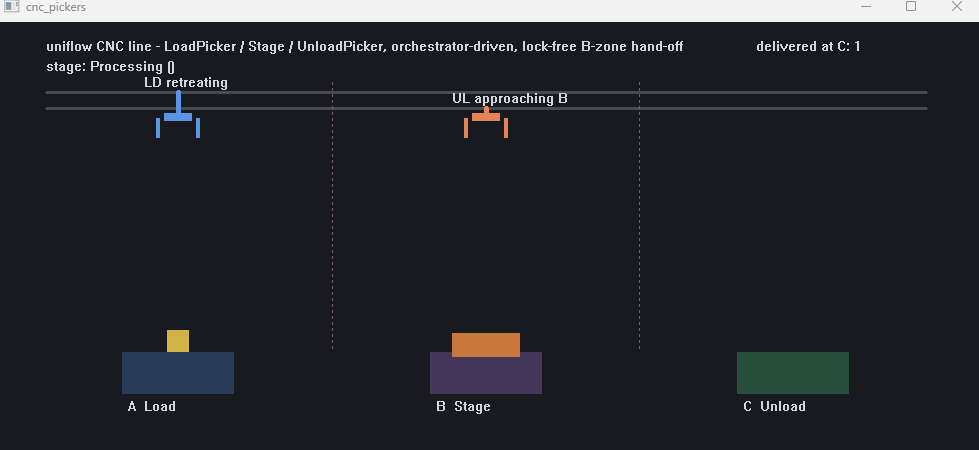

# cnc_pickers

> 🌐 Language: [한국어](README.kr.md) | **English** &nbsp;|&nbsp; [<- Example gallery](../../../EXAMPLES.md)

<p align="center">
  
</p>

uniflow's reference project. It runs a virtual CNC machining line on a single pump. The Load picker grabs raw stock from zone A and places it at zone B, the Stage machines it at B, and the Unload picker carries it from B out to zone C.

The core of this example is solving a classic equipment-automation problem - **two pickers must never be in zone B at the same time** - with an orchestrator and inter-module state polling. Because every module lives on the same pump, sharing zone-occupancy state needs no locks.

---

## What it shows

- **The Cmd -> Wait 2-step motion pattern** - every axis/gripper action is a pair: a "command" step (`OnLoad_CmdMoveToSource`) and a "poll for arrival" step (`OnLoad_WaitAtSource`, which `Stay()`s while polling `InPosition()`). The natural skeleton for equipment motion code.
- **Virtual hardware modeling** - `MotorAxis` mimics acceleration and settle time, and `Stay()` polling implements "wait until arrival" without blocking.
- **Mutual exclusion without locks** - the Load/Unload pickers check the other's position via `PartnerInZoneB()` to avoid entering zone B together. Both run on the same pump thread, so a plain member read is enough.
- **The orchestrator pattern** - `UF_Orchestrator` coordinates the whole line: raw-part spawning (time-driven) and starting each module's next flow (state-driven, watching `picker.IsIdle()` / `stage.state()`). Pickers and the Stage never decide *when* to move on their own.
- **Console + file dual logging** - `EnvLogObserver` writes the `ConsoleObserver` output to both the console and `cnc_pickers.log`. A real-world custom observer.

---

## The model

| Module | Role |
|---|---|
| `UF_LoadPicker` | Carries raw stock A -> B. A 16-step cycle (move/lower/grip/lift/move/lower/release/lift/retreat) |
| `UF_Stage` | Machines at zone B. Starts a machining flow when a picker drops a part, then becomes ready for Unload |
| `UF_UnloadPicker` | Carries the machined part B -> C |
| `UF_Orchestrator` | The line scheduler. Owns raw-part creation timing and starting each module's next flow |
| `UF_Visualization` | Real-time line visualization with Win32 |

All are held as members of `App` with two-phase init: phase 1 constructs every module (ctor bodies do not touch other modules), and phase 2 `Start()` launches flows (cross-module references are safe from then on).

---

## Files worth reading

- [uf_orchestrator.cpp](uf_orchestrator.cpp) - everything about scheduling (spawn/start decisions)
- [uf_load_picker.cpp](uf_load_picker.cpp) - the 16-step picker cycle, the Cmd -> Wait pattern in full
- [app.h](app.h) - the two-phase init pattern, Runtime Opts (threads/observer/sleep policy)
- [env_log_observer.h](env_log_observer.h) - a custom observer writing to console + file
- [picker_motion.h](picker_motion.h) - the virtual motor-axis / gripper model

---

## Build / run

It uses Win32 visualization, so this is a Windows + MSVC example. A `.vcxproj` is included.

```powershell
# Visual Studio
add cpp\examples\cnc_pickers\cnc_pickers.vcxproj to your solution and hit F5

# CLI (MSVC, vcvars64 environment)
cl /std:c++17 /EHsc /I cpp cpp\examples\cnc_pickers\*.cpp /Fe:build\cnc_pickers.exe /Fo:build\
```

A line window opens, and step transitions are written to both the console and `cnc_pickers.log`. When you close the window, the delivered part count prints on exit:

```text
parts delivered to Unload: 7
```

---

## Read more

- The Cmd -> Wait polling pattern: [TUTORIAL.md chapters 3-4](../../../TUTORIAL.md)
- Writing a custom observer: [TUTORIAL.md chapter 8](../../../TUTORIAL.md)
- The orchestration pattern: [TUTORIAL.md final chapter](../../../TUTORIAL.md)
- Full example gallery: [EXAMPLES.md](../../../EXAMPLES.md)
